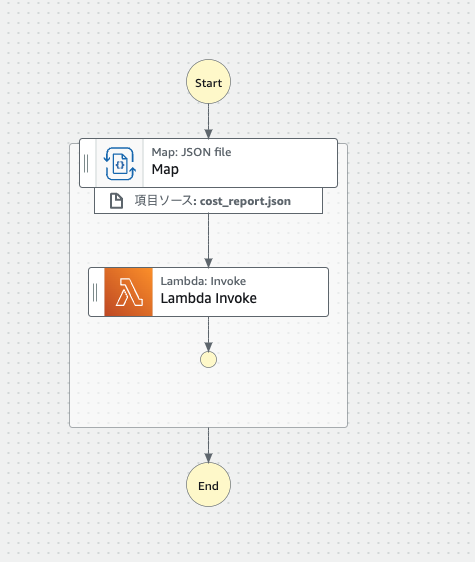
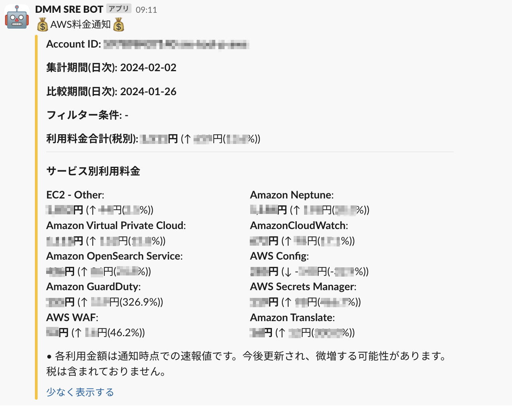

# AWSの利用状況のSlack通知処理を共通化した話

おはようございます、こんにちは。ITインフラ本部 SRE部のかわむらと申します。私の所属しているSRE部では、
Site Reliability Engineering の観点から、グループを横断してシステムの信頼性を向上させる取り組みを行っておりますが、いわゆるCCoE(Cloud Center of Excellence)
としての活動も行っており、グループ内のパブリッククラウドの利用推進や改善も担当しております。本日はAWS Organizationsを利用したアカウント管理の効率化の一環として通知処理を共通化した話を紹介します。

## DMMにおけるAWSの利用状況 
DMMでは、多くのサービスがAWSで稼働しております。各サービスはサービスごと（あるいは環境ごと）にAWSアカウントを持っており、
それぞれのサービスを担当するエンジニアリングチームが開発や運用を行っております。技術選定やアーキテクチャなどは、各チームに委ねられており、
エンジニアにとっては自由度があり、好きに作れる良さがある一方、アカウント管理や運用の効率化のために必要な諸タスクもそれぞれのチームに委ねられており、 同じようなものをそれぞれのチームが個別実装している、という状況がありました。

サービスを担当するエンジニアリングチームは、サービスの開発・運用に集中するべきで、共通化できる処理は共通化してしまうことのが望ましいです。 そこで、AWS Organizationsを活用して、ニーズの高い通知処理を共通化して提供することを推進しています。

## 共通処理の実装
AWSでは複数のAWSアカウントを組織単位で管理するためのサービスとして、AWS Organizationsというサービスが用意されています。組織内のアカウントをグループ化し、組織全体でのポリシーの適用や、組織全体でのリソースの一元管理を行うことができます。
ここでは例としてAWSの利用料金通知の実装を紹介します。システムコストの通知はサービスの運用において重要な情報であり、共通化のニーズが非常に高いです。

アカウントごとに、通知内容をカスタムできるようにしたいので、設定ファイルにそのような情報をもたせ、それを元に通知処理を行うことにします。
設定ファイルに保存されたアカウント情報等を元に、コスト情報を並列処理で取得し、通知する処理を実装します。このような処理の実装はいろいろな手段があるとおもいますが、AWS Step FunctionsとAWS Lambdaを使うと、手軽にWorkflowを実装することができます。

設定ファイルは以下のようなイメージです。通知内容をアカウントごとにカスタムできるようにパラメータを用意します。コストを週次で通知してくれると嬉しいというようなニーズも存在するので、事業別に設定できるようにし、設定ファイルはGoogle Spreadsheetなどを使い、事業側で編集、反映可能にしています。

```
[
  {
    "AccountId": "___your_account_id___",
    "Description": "hogehoge service staging env",
    "ChannelIds": [
      "CR96Q1EJW"
    ],
    "Currency": "JPY",
    "Granularity": [
      "DAILY"
    ],
    "CostTags": ""
  },
  ...(略
]
```

Step Functionsで作るWorkflowは以下のようになります。設定ファイルに記載された対象アカウントをStep FunctionsのMapステートメントで読み出し並列実行します。今回のユースケースでは対象データが大量になることはないですが、StepFunctions + Lambdaの組み合わせは、大規模対応可能なデータ処理のためのソリューションのひとつとして注目しています。今後他のユースケースでも活用できそうです。



## コストの取得
AWSのコスト情報は、AWS Cost Explorer APIを使って取得することができます。AWS Organizationsのメンバーアカウントからデータを取得するには LINKED_ACCOUNTというパラメータにAccount Idを
取得するように実装します。Lambdaコードは以下のようになります。帰ったレスポンスを整形して通知します。

```
def get_cost_report(account_id, start_date, end_date, filter_tags_condition):
    """
    指定された期間のコストレポートを取得
    Parameters:
    - account_id (str): AWSアカウントID
    - start_date (datetime.date): レポートの開始日
    - end_date (datetime.date): レポートの終了日
    - filter_tags_condition (list): タグによる絞り込み条件(Optional)
    Returns:
    - dict: コストと使用量の情報
    """

    query = {
        'TimePeriod': {
            'Start': start_date.strftime('%Y-%m-%d'),
            'End': end_date.strftime('%Y-%m-%d')
        },
        'Granularity': 'DAILY',
        'Metrics': ['BlendedCost'],
        'GroupBy': [
            {
                'Type': 'DIMENSION',
                'Key': 'SERVICE'
            }
        ]
    }

    if filter_tags_condition:
        query['Filter'] = {
            'And': [
                {
                    'Dimensions': {
                        'Key': 'LINKED_ACCOUNT',
                        'Values': [account_id]
                    }
                }
            ]
        }
        for filter_tag in filter_tags_condition:
            query['Filter']['And'].append({'Tags': filter_tag})
    else:
        query['Filter'] = {
            'Dimensions': {
                'Key': 'LINKED_ACCOUNT',
                'Values': [account_id]
            }
        }

    session  = get_sts_session()
    client   = session.client('ce', region_name='us-east-1')
    response = client.get_cost_and_usage(**query)
    return response
```

できたStep FunctionをAmazon EventBridge スケジューラなどで定期実行すれば、、、はい、このような形で、コストの通知を受信することができました。（実際にはSlack側のアプリ設定などが必要ですが、ここでは割愛します。）


## まとめ
さて、今回は、ITインフラ本部 SRE部のCCoE的な活動の一例として、AWS Organizationsを活用した共通処理の実装についてご紹介しました。一例として、コスト通知を紹介しましたが、他のサービス運用に有用な情報通知も同じような仕組みで提供していくことをすすめています。
AWSが提供している通知機能で十分な場合もありますが、通知内容はカスタマイズしつつ、処理の実装・実行は共通化すると、効率よく事業や組織のニーズに応えられるのではないでしょうか。

CcoE、またはSRE的なアプローチでDMMのサービスを横断的に改善していく仕事に興味がある方、現在積極的に採用活動を行っておりますので、是非ご検討ください。
- [パブリッククラウドインフラエンジニア](https://dmm-corp.com/recruit/engineer/1672/)
- [SRE](https://dmm-corp.com/recruit/engineer/8/)

