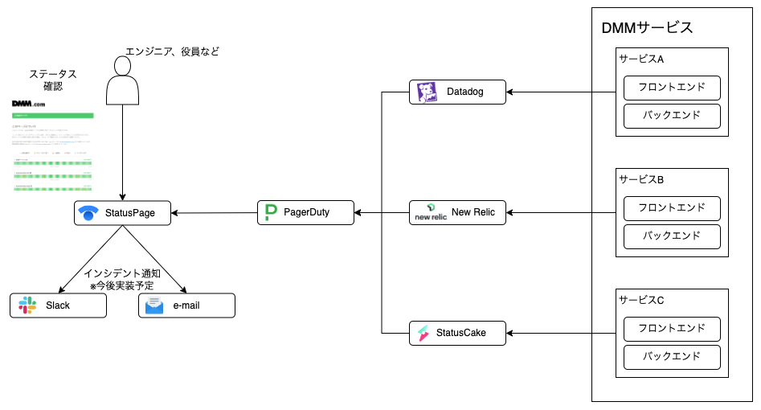

# サービスの稼働状況をStatus Pageを使って可視化した話

## はじめに
この記事は DMMグループ Advent Calendar 2023 のxx日目の記事です。

こんにちは、ITインフラ本部、SRE部です。
私たちSRE部では、DMMグループの各サービスの信頼性を横断的に向上させることをミッションに活動しております。

はやいものでもう年末ですね。毎年Advent Calendarの執筆依頼があると、もうそんな季節なのかと感じます。
今年の仕事の中からなにか面白い話を出せないかと思い色々考えたのですが、先日社内のサービスの稼働状態を可視化する仕組み（以下、Internal Status Page）を社内にリリースしましたので、まだ道半ばではありますが、その話を共有したいと思います。

## なぜ Internal Status Pageを作ろうと思ったのか
DMM.comグループでは現在60以上の事業を展開しており、数多くのサービスがシステムとして稼働しています。

各担当部門が、それぞれでシステムの監視やアラート対応などを行っており、運用のダッシュボードなどもそれぞれ作られています。

そのためサービス単体の運用に関しては、大きな問題はありません。

しかし、弊社の場合、社内共通の認証基盤や、会員系APIなどの共通系サービス以外でも、サービス間の依存関係などがあり、
自分の担当以外のサービスの稼働状況を手早く知りたいというケースが多々あります。

社内サービスの稼働状況を把握できるStatus Pageがあれば、そのニーズに応えられるだろうと考えました。

## Internal Status Pageについて

### サービスの選定基準
自作する選択肢もあったかもしれないですが、今回はSaasが提供しているものを利用することにしました。Pagerdutyなど、いくつかの企業がInternal Status Pageを
実現するサービスを提供していますが、今回はAtlassianのStatuspageを利用することにしました。全従業員がログインなしでアクセスできること、ページのカスタマイズができることなどが決め手になりました。

ご参考
- [Atlassian Statuspage](https://www.atlassian.com/software/statuspage)

### システム構成

DMMでは、それぞれのサービスの監視にはDatadog, NewRelic, StatusCakeなどを利用しています。
これらのサービスから情報を集約し、Statuspageに反映させる仕組みを構築しました。 以下のようなイメージです。

### 構成要素について

**Datadog / NewRelic:** サービスのパフォーマンス監視とアラート生成をしています。問題を検知した際には即座にPagerDutyへアラートを送信します。

**PagerDuty:** 監視ツールでのアラート状態をStatusPageに渡すためのハブ機能として利用します。

**StatusPage:** サービスの稼働状態を公開し、社員全員が確認できるように情報を提供します。障害発生時にはStatusPageが最新のステータスを表示し、現在の状況を把握できるようにします。

#### できた！

(スクリーンショットを貼る。テスト版でかまわない)

各サービスの稼働状況が俯瞰して見れるようになりました。各サービスの問い合わせ先などの情報も確認可能になっています。
社内のすべてのロールの方がグループ内のサービスの稼働状況をリアルタイムに確認できるようになったことは、不要な問い合わせを減らしたり、
情報を求めてSlackを探し回る時間などを減らすことができ、様々な場面で業務が効率化されるであろうと期待しています。

## 今後の展開

- インシデント情報との連携強化
社内のサービスにインシデントやパフォーマンス劣化がおきているかについては確認できるようになりましたが、まだそれ以上の情報が掲載できていません。
インシデントの対応状況、議論されているSlack Channel、ポストモーテムなどと連携できるようにしていく予定です。

## 最後に
SRE部では共に仲間を募集しています！大規模なサービスや立ち上がったばかりの新事業など、様々な規模、ジャンル・フェーズが存在する環境でSREを実践しませんか？
Statuspageの取り組みなどはほんの一部で、SLO/SLIの設計や、共通ツールの開発など、多様な横断的な取り組みを行っています。カジュアル面談などお気軽にご連絡ください！

それでは皆さん良いクリスマスをお過ごしください〜
