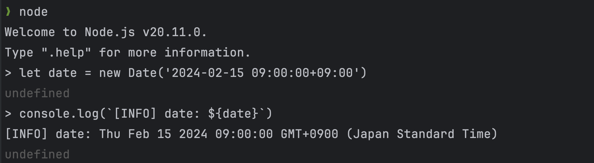
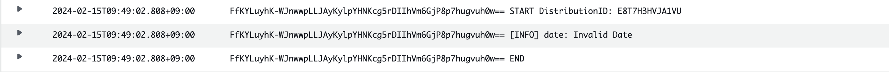

# CloudFront Functions + CloudFront KeyValueStore を用いた書影処理の高速化

こんにちは。ITインフラ本部 SRE部の周です。現在電子書籍事業部でAWS関連の業務を担当しています。

その一環として、Lambda@Edge で実装されていた書影画像の非公開チェック機能を高速化させるため、

新しく CloudFunctions で実装することを行いました。

# CloudFront Functions と Lambda@Edge の違い

まず、 CloudFront Functions と Lambda@Edge の違いを明確にしようと思います。

|  | CloudFront Functions                                                                                                                                                                                                       | Lambda@Edge |
| --- |----------------------------------------------------------------------------------------------------------------------------------------------------------------------------------------------------------------------------| --- |
| ランタイム | cloudfront-js ([JavaScriptの一部の機能しかサポートしていません](https://docs.aws.amazon.com/ja_jp/AmazonCloudFront/latest/DeveloperGuide/functions-javascript-runtime-20.html#writing-functions-javascript-features-restricted-features-20)) | Node.js, Python, Ruby, Java, .NET, Amazon Linux(RustやGoなど用に) |
| 実行速度 | 非常に高速である                                                                                                                                                                                                                   | 複雑なタスクを実行できる分、比較的レイテンシーが大きい |
| 用途と複雑性 | URLの書き換えなど、非常に小規模で高速な実行が必要な用途に向いている                                                                                                                                                                                        | より複雑なアプリケーションロジックをエッジで実行できる |

電子書籍事業部で使用されている書影画像の非公開チェックは「 CloudFront で配信されている書影画像に対して、まだ公開していない作品の場合は now printing と呼ばれる画像を代わりに表示する」というシンプルな機能です。シンプルな機能であり、かつ高速にコンテンツを配信したいため、本来 CloudFront Functions の方が適しています。

# なぜ Lambda@Edge だったのか？

作品の公開日時はAuroraに保存されており、非公開チェックの処理は何かしらの手段でこの公開日時情報にアクセスする必要があります。

直接AuroraやElastiCache、S3等にアクセスできたとしても、 CloudFront Functions の[コンピューティング使用率制限](https://docs.aws.amazon.com/ja_jp/AmazonCloudFront/latest/DeveloperGuide/cloudfront-function-restrictions.html)を簡単に超えてしまいます。
そのため、CloudFront KeyValueStore がリリースされるまでは、CloudFront Functions では実装できませんでした。

# CloudFront KeyValueStore の何が嬉しいのか？

CloudFront Functions は高速に実行できる代わりに Lambda@Edge よりも制限が厳しいです。

作品の公開日時情報など、何かしらのデータを参照して処理する場合、直接 CloudFront Functions のソースコードにハードコーディングできるレベルであればまだ良いですが。頻繁に更新される、あるいは大量のデータから検索する必要があるなどの場合はどうしてもデータをどこかに保存しなければいけません。

今までは CloudFront Functions から使用できる保存場所がなかったため、Lambda@Edge を使わざるを得ないことも多かったと思います。

CloudFront KeyValueStore という CloudFront Functions から呼び出せる非常に低レイテンシーな KVS がリリースされたおかげで、この問題を解決できるようになりました。

# CloudFront KeyValueStore について知っておいた方が良いこと

CloudFront KeyValueStore は比較的に新しくリリースされた機能であるため、AWSの他のサービスよりもまだ出回っている情報が少ないです。

今回の書影高速化作業で重要だと感じだポイントをいくつか纏めておきます。

## CloudFront KeyValueStore は ETag という仕組みによってバージョン管理をしています。

CloudFront KeyValueStore は複数の更新リクエストを並列に処理できず、１つずつ順番にリクエストを送信する必要があります。 

データを保存したい場合はまず該当する CloudFront KeyValueStore の ETag の値を取得する必要があります。

```bash
$ aws cloudfront-keyvaluestore describe-key-value-store --kvs-arn <KeyValueStoreのARN>
{
    "ETag": "XXXXXXXXXXXXXXXX",
    "ItemCount": 1,
    "TotalSizeInBytes": 10,
    "KvsARN": "arn:aws:cloudfront::00000000000:key-value-store/00000000-0000-0000-0000-000000000000",
    "Created": "2024-03-14T09:02:12.595000+09:00",
    "LastModified": "2024-03-14T09:37:11.771000+09:00"
}
```

次に取得した ETag の値を使用してデータを CloudFront KeyValueStore に保存します。

```bash
$ aws cloudfront-keyvaluestore put-key --key '/sample' --value 'sample' --kvs-arn <KeyValueStoreのARN> --if-match <ETag>
{
    "ETag": "XXXXXXXXXXXXXXXX",
    "ItemCount": 2,
    "TotalSizeInBytes": 23
}
```

正しくデータを保存できた場合は、新しい ETag も同時に取得できます。**１つの ETag は一回しか使用できません**ので、複数のデータを保存する際は都度最新のETag を取得してから保存リクエストを送信する必要があります。

## CloudFront のエッジサーバーによっては少しの反映のラグがあります。

CloudFront KeyValueStore に保存したデータは同時に全てのエッジサーバーに反映される訳ではありません。

実験として新しいデータを保存してすぐ CloudFront Functions から値を取得してみます。

まず下記のコードで CloudFront Functions を作成し、任意の CloudFront のビュワーリクエストに関連付けさせます。

リクエストURIをキーとして CloudFront KeyValueStore にアクセスして値を取り出すだけの処理です。

```jsx
import cf from 'cloudfront'

const kvsId = '00000000-0000-0000-0000-000000000000'
const kvsHandle = cf.kvs(kvsId)

async function handler(event) {
    let key = event.request.uri

    try {
        let value = await kvsHandle.get(key)
        console.log(`[INFO] kvs: ${key}: ${value}`)
        return {
            statusCode: 200,
            statusDescription: 'Success',
        }
    } catch (err) {
        if (err.toString() !== 'Error: KeyNotFound') {
            console.log(`[ERROR] Kvs key lookup failed for ${key}: ${err}`)
        } else {
            console.log(`[INFO] Kvs key not found for ${key}`)
        }
        return {
            statusCode: 500,
            statusDescription: 'Internal Server Error',
        }
    }
}
```

次にデータの保存コマンドを実行してから、すぐに CloudFront にアクセスしてレスポンスを確認します。

そうすると、データを取得できた場合(200)とデータを取得できなかった場合(500)のレスポンスが混ざって返ってくることが分かります。

```bash
$ aws cloudfront-keyvaluestore put-key --key '/test' --value 'test' --kvs-arn <KeyValueStoreのARN> --if-match <ETag>

$ curl -I https://<CloudFrontのDNS名>/test
HTTP/2 200 
server: CloudFront
date: Thu, 14 Mar 2024 01:00:38 GMT
content-length: 0
x-cache: FunctionGeneratedResponse from cloudfront
via: 1.1 1a14b40ef6c4ba4b405703e2217e79c6.cloudfront.net (CloudFront)
x-amz-cf-pop: NRT20-P1
x-amz-cf-id: rw1wklm8PnH2BIAm-3E-lhl1HCUXQ9Qdvd83Lr3fX7R94D_dW6RB9g==

$ curl -I https://<CloudFrontのDNS名>/test
HTTP/2 500 
server: CloudFront
date: Thu, 14 Mar 2024 01:00:38 GMT
content-length: 0
x-cache: FunctionGeneratedResponse from cloudfront
via: 1.1 64e0542a84a2ed807451f1be5fec7a18.cloudfront.net (CloudFront)
x-amz-cf-pop: NRT20-P1
x-amz-cf-id: IMUYw4dHJHH1tklf4ElRnemQbeMAjVnU5vACfaXxWRFVG6nakTR_vw==

$ curl -I https://<CloudFrontのDNS名>/test
HTTP/2 200 
server: CloudFront
date: Thu, 14 Mar 2024 01:00:39 GMT
content-length: 0
x-cache: FunctionGeneratedResponse from cloudfront
via: 1.1 a491e094d88d6b601fcc0862c4bda40a.cloudfront.net (CloudFront)
x-amz-cf-pop: NRT20-P1
x-amz-cf-id: SQ24uKzGn8Pqeo4vCvex9NAo0AcrJbtU3u9OSfLoHnJXhqjZKKaHZw==
```

CloudWatch Logs のログからもデータが取得できる場合とできない場合が発生することが読み取れます。

ちなみに CloudFront Functions のログはus-east-1 リージョンの CloudWatch Logs で [`/aws/cloudfront/function/](https://us-east-1.console.aws.amazon.com/cloudwatch/home?region=us-east-1#logsV2:log-groups/log-group/$252Faws$252Fcloudfront$252Ffunction$252Ftest)ファンクション名` という名前のロググループに保存されています。

```
I2RwSwOzElwqRYDHMUGGVXY2WEAfrXcSQ7wH0-LrfR6-gvvVirTRkg== START DistributionID: E3PRGEQJ9KXVWD
I2RwSwOzElwqRYDHMUGGVXY2WEAfrXcSQ7wH0-LrfR6-gvvVirTRkg== [INFO] Kvs key not found for /test
I2RwSwOzElwqRYDHMUGGVXY2WEAfrXcSQ7wH0-LrfR6-gvvVirTRkg== END
rm1Q_jD9Y6xzg_NfYiI_E_5gT4n9e2Ws1O40FsvLAEn_jIOlp9G9dQ== START DistributionID: E3PRGEQJ9KXVWD
rm1Q_jD9Y6xzg_NfYiI_E_5gT4n9e2Ws1O40FsvLAEn_jIOlp9G9dQ== [INFO] Kvs key not found for /test
rm1Q_jD9Y6xzg_NfYiI_E_5gT4n9e2Ws1O40FsvLAEn_jIOlp9G9dQ== END
p5ZPNyTAZD1WerDWlNoruPynNsC84M30GnBCXuUyI0DZuARyAsFhqQ== START DistributionID: E3PRGEQJ9KXVWD
p5ZPNyTAZD1WerDWlNoruPynNsC84M30GnBCXuUyI0DZuARyAsFhqQ== [INFO] kvs: /test: test
p5ZPNyTAZD1WerDWlNoruPynNsC84M30GnBCXuUyI0DZuARyAsFhqQ== END
5Pxcoi-YHyHOZbV5JeehVJHn83xz2NlWZKcJuR7ZhnyfO2mEilEqmA== START DistributionID: E3PRGEQJ9KXVWD
5Pxcoi-YHyHOZbV5JeehVJHn83xz2NlWZKcJuR7ZhnyfO2mEilEqmA== [INFO] Kvs key not found for /test
5Pxcoi-YHyHOZbV5JeehVJHn83xz2NlWZKcJuR7ZhnyfO2mEilEqmA== END
jyTUuJraiAuJU-j4f1hrdySFqTlNL7pEyrkUEuEdQwuCw1i2Oh_S7A== START DistributionID: E3PRGEQJ9KXVWD
jyTUuJraiAuJU-j4f1hrdySFqTlNL7pEyrkUEuEdQwuCw1i2Oh_S7A== [INFO] kvs: /test: test
jyTUuJraiAuJU-j4f1hrdySFqTlNL7pEyrkUEuEdQwuCw1i2Oh_S7A== END
rw1wklm8PnH2BIAm-3E-lhl1HCUXQ9Qdvd83Lr3fX7R94D_dW6RB9g== START DistributionID: E3PRGEQJ9KXVWD
rw1wklm8PnH2BIAm-3E-lhl1HCUXQ9Qdvd83Lr3fX7R94D_dW6RB9g== [INFO] kvs: /test: test
rw1wklm8PnH2BIAm-3E-lhl1HCUXQ9Qdvd83Lr3fX7R94D_dW6RB9g== END
IMUYw4dHJHH1tklf4ElRnemQbeMAjVnU5vACfaXxWRFVG6nakTR_vw== START DistributionID: E3PRGEQJ9KXVWD
IMUYw4dHJHH1tklf4ElRnemQbeMAjVnU5vACfaXxWRFVG6nakTR_vw== [INFO] Kvs key not found for /test
IMUYw4dHJHH1tklf4ElRnemQbeMAjVnU5vACfaXxWRFVG6nakTR_vw== END
```

次は実際にデータを保存してから反映されるまでの時間を計測してみます。
下記のスクリプトで、データのを保存した直後からループでデータを取得し続け、データが取得できるまでの時間を計測します。
```bash
#!/bin/bash

set -eu

key="/latency-test-key-01"
kvs_arn="<使用するCloudFrontKeyValueStoreのARN>"
etag=$(aws cloudfront-keyvaluestore describe-key-value-store --kvs-arn $kvs_arn | jq -r '.ETag')
aws cloudfront-keyvaluestore put-key --key $key --value "test" --kvs-arn $kvs_arn --if-match $etag


for _ in {1..100}
do
    # 現在のタイムスタンプを取得
    timestamp=$(date "+%Y-%m-%d %H:%M:%S")
    # curl コマンドを実行し、HTTP/2 のステータスコードを取得
    status_code=$(curl -sI "https://<CloudFrontのDNS>${key}" | grep HTTP/2 | cut -d' ' -f2)
    # タイムスタンプとステータスコードを出力
    echo "${timestamp} ${status_code}"
    # 1 秒待機
    sleep 1
done
```
下記のログを見ると、 `10:26:07` にアクセスを開始して　`10:26:47` から `200` と　`500` が混ざって返ってくるようになりました。
`10:26:54` からは常に `200` が返ってくるようになりました。
したがって、40秒ほどで一部反映されるようになり、1分ほどで全てのエッジサーバーに反映されるようになりました。
```text
2024-03-21 10:26:07 500
2024-03-21 10:26:08 500
2024-03-21 10:26:09 500
2024-03-21 10:26:10 500
2024-03-21 10:26:11 500
2024-03-21 10:26:12 500
2024-03-21 10:26:13 500
2024-03-21 10:26:15 500
2024-03-21 10:26:16 500
2024-03-21 10:26:17 500
2024-03-21 10:26:18 500
2024-03-21 10:26:19 500
2024-03-21 10:26:20 500
2024-03-21 10:26:21 500
2024-03-21 10:26:22 500
2024-03-21 10:26:23 500
2024-03-21 10:26:24 500
2024-03-21 10:26:25 500
2024-03-21 10:26:27 500
2024-03-21 10:26:28 500
2024-03-21 10:26:29 500
2024-03-21 10:26:30 500
2024-03-21 10:26:31 500
2024-03-21 10:26:32 500
2024-03-21 10:26:33 500
2024-03-21 10:26:34 500
2024-03-21 10:26:35 500
2024-03-21 10:26:36 500
2024-03-21 10:26:37 500
2024-03-21 10:26:38 500
2024-03-21 10:26:40 500
2024-03-21 10:26:41 500
2024-03-21 10:26:42 500
2024-03-21 10:26:43 500
2024-03-21 10:26:44 500
2024-03-21 10:26:45 500
2024-03-21 10:26:46 500
2024-03-21 10:26:47 200
2024-03-21 10:26:48 200
2024-03-21 10:26:49 500
2024-03-21 10:26:50 200
2024-03-21 10:26:52 200
2024-03-21 10:26:53 500
2024-03-21 10:26:54 200
2024-03-21 10:26:55 200
2024-03-21 10:26:56 200
2024-03-21 10:26:57 200
2024-03-21 10:26:58 200
2024-03-21 10:26:59 200
2024-03-21 10:27:00 200
2024-03-21 10:27:01 200
2024-03-21 10:27:02 200
2024-03-21 10:27:03 200
2024-03-21 10:27:05 200
2024-03-21 10:27:06 200
2024-03-21 10:27:07 200
2024-03-21 10:27:08 200
2024-03-21 10:27:09 200
2024-03-21 10:27:10 200
2024-03-21 10:27:11 200
```

# 実際に再実装した際に遭遇した大変だったこと

書影画像の非公開チェックを CloudFront Functions + CloudFront KeyValueStore で再実装した際に、上手く行かなかった点も少し紹介します。

## cloudfront-js と Node.js は互換性がありません。

URLを書き換えたり、ヘッダーを書き換えたりするような極めてシンプルな処理の場合にはあまり影響はありませんが、CloudFront KeyValueStore がリリースされたことで、CloudFront Functions で少し複雑な処理を行おうとするとランタイムの差で困ることがあるかもしれません。

文字列として CloudFront KeyValueStore に保存した作品公開日時を Date オブジェクトに変換しようとする場合、一般的に下記のような実装が考えられます。

```jsx
let date = new Date('2024-02-15 09:00:00+09:00')
console.log(`[INFO] date: ${date}`)
```

もちろん、この実装はローカルのNode.jsのランタイムでは実行できます。



ローカルでテストしてから、CloudFront Functions にデプロイすると下記のように `Invalid Date` になります。



ちなみにこの場合、例外は発生せず、そのまま処理が進みます。下記のような比較は常に `false` と判定されるため、少し気づきにくいです。

```jsx
let date = new Date('2024-02-15 09:00:00+09:00')
let now = new Date()
console.log(date > now)
```

今回は仕方なく下記のように日付のパースを実装しました。

```jsx
// CloudFront Functions のランタイムでは Node.js と違って、`new Date('2024-02-15 09:00:00')` を実行すると `Invalid Date` になるため、
// 正規表現でパースしてから `new Date(year, month, day, hours, minutes, seconds)` で Date オブジェクトを生成する。
function parseDateTime(dateTimeString) {
    const regex = /^(\d{4})-(\d{2})-(\d{2})\s(\d{2}):(\d{2}):(\d{2})$/
    const match = dateTimeString.match(regex)
    const year = parseInt(match[1], 10)
    const month = parseInt(match[2], 10) - 1 // JavaScriptの月は0から始まるため
    const day = parseInt(match[3], 10)
    const hours = parseInt(match[4], 10)
    const minutes = parseInt(match[5], 10)
    const seconds = parseInt(match[6], 10)
    return new Date(year, month, day, hours, minutes, seconds)
}
```

## TerraformがまだCloudFront Functionsをサポートしていない

電子書籍事業部のAWSはTerraform管理されているため、今回もTerraformで各種リソースを定義しましたが、ここで１つ大きな落とし穴があります。

2024/03/15時点 Terraform の CloudFront KeyValueStore の対応はまだ不完全なため、リソースを作成することは可能ですが、「CloudFront Functions と CloudFront KeyValueStore の関連付け」を定義できません。

リソースを Terraform で作成してから、AWS コンソールから手動で関連付けを設定しましたが、 `terraform apply` を実行すると関連付けが消されるため、CloudFront Functions から CloudFront KeyValueStore にアクセスできなくなります。

Terraform でデプロイできないため、今回は下記のような Bash スクリプトで aws-cli を使ってデプロイする処理を CI に入れました。

```bash
function deploy(){
  local function_name=$1
  local key_value_store_arn=$2
  local key_value_store_id
  key_value_store_id=$(echo "${key_value_store_arn}" | awk -F'/' '{print $NF}')

  local source_file
  source_file="temp_function_$(date +%s).js"
  cp function.js "${source_file}"
  sed -i '' "s/<KVS_ID>/${key_value_store_id}/g" "${source_file}"

  local etag_current
  etag_current=$(aws cloudfront describe-function --name "${function_name}" | jq -r '.ETag')
  aws cloudfront update-function \
    --name "${function_name}" \
    --if-match "${etag_current}" \
    --function-code "fileb://${source_file}" \
    --function-config Comment="Updated at $(date)",Runtime=cloudfront-js-2.0,KeyValueStoreAssociations="{Quantity=1,Items=[{KeyValueStoreARN=\"${key_value_store_arn}\"}]}"
  rm "${source_file}"

  local etag_publish
  etag_publish=$(aws cloudfront describe-function --name "${function_name}" | jq -r '.ETag')
  aws cloudfront publish-function \
      --name "${function_name}" \
      --if-match "${etag_publish}"
}
```

## 更新リクエストは１つずつしか受け付けない

CloudFront KeyValueStore は ETag の仕組みを使って、リクエストを順番に送信する必要があります。

Aurora から公開日時情報を CloudFront KeyValueStore に取り込むバッチを10分毎に動かすようにしていましたが、バッチの実行が10分以内に終了しないことがあり、その場合は2つのバッチが同時に実行されるタイミングが発生します。

CloudFront KeyValueStore へのリクエストは正しい順番で実行しないとエラーが発生するため、更新バッチが複数同時に動作するとエラーになってしまいます。

そのため、バッチの実行間隔を前回のバッチが確実に実行完了している20分間に増やしました。

## Golangから使う場合の情報がとにかく少ない

比較的に新しくリリースされた機能であり、インターネット上でも情報が少ないため、まず生成AIは役に立ちませんでした。

「CloudFront Functions で CloudFront KeyValueStore から値を取得するサンプルを Golang で書いてください。」と指示してみましたが、ChatGPT(GPT-4) も Gemini Advanced も現時点間違った回答しか生成しません。

AWSのドキュメントや各種インターネット上の記事を調べてもあまり情報がないので、ここに Golang での実装方法を残しておきます。

**必要なパッケージ**

```go
"github.com/aws/aws-sdk-go-v2/aws"
"github.com/aws/aws-sdk-go-v2/config"
"github.com/aws/aws-sdk-go-v2/service/cloudfrontkeyvaluestore"
"github.com/aws/aws-sdk-go-v2/service/cloudfrontkeyvaluestore/types"
```

**クライアントの初期化**

```go
cfg, err := config.LoadDefaultConfig(context.Background())
if err != nil {
	log.Fatalf("Unable to load SDK config, %v", err)
}
kvsClient := cloudfrontkeyvaluestore.NewFromConfig(cfg)
```

**ETag の取得**

```go
input := &cloudfrontkeyvaluestore.DescribeKeyValueStoreInput{
	KvsARN: aws.String("<使用するCloudFrontKeyValueStoreのARN>"),
}

output, err := kvsClient.DescribeKeyValueStore(context.Background(), input)

if err != nil {
	fmt.Printf("failed to describe KVS: %s.", err)
} else if output.ETag == nil {
	fmt.Println("ETag not found in KVS description.")
} else {
	fmt.Println("ETag: ", *output.ETag)
}
```

**データの保存**

```go
input := &cloudfrontkeyvaluestore.PutKeyInput{
	IfMatch: aws.String("<事前に取得したETagの値>"),
	Key:     aws.String("<保存したいデータのキー>"),
	Value:   aws.String("<保存したいデータの値>"),
	KvsARN:  aws.String("<使用するCloudFrontKeyValueStoreのARN>"),
}

if _, err := kvsClient.PutKey(context.Background(), input); err != nil {
	fmt.Printf("failed to put key: %s", err)
} else {
	fmt.Println("Successfully put key")
}
```

**データの一括保存 (2024/3/21現在は確認したところ、一回の保存数が32を超えるとAWSの上限に引っかかります)**

```go
keyValues := map[string]string{
	"key1": "value1",
	"key2": "value2",
}
items := make([]types.PutKeyRequestListItem, 0, len(keyValues))
for key, value := range keyValues {
	items = append(items, types.PutKeyRequestListItem{
		Key:   aws.String(key),
		Value: aws.String(value),
	})
}
input := &cloudfrontkeyvaluestore.UpdateKeysInput{
	IfMatch: aws.String("<事前に取得したETagの値>"),
	Puts:    items,
	KvsARN:  aws.String("<使用するCloudFrontKeyValueStoreのARN>"),
}
if _, err := kvsClient.UpdateKeys(context.Background(), input); err != nil {
	fmt.Printf("failed to update keys: %s", err)
} else {
	fmt.Println("Successfully updated keys")
}
```

# まとめ

今回は、電子書籍事業部で使用している書影の非公開チェック処理を Lambda@Edge から CloudFront Functions に切り替えることで処理の高速化を実現できました。同じような状況で仕方なく Lambda@Edge で実装してきた方も多いのではないでしょうか？この記事がお役に立てれば幸いです。