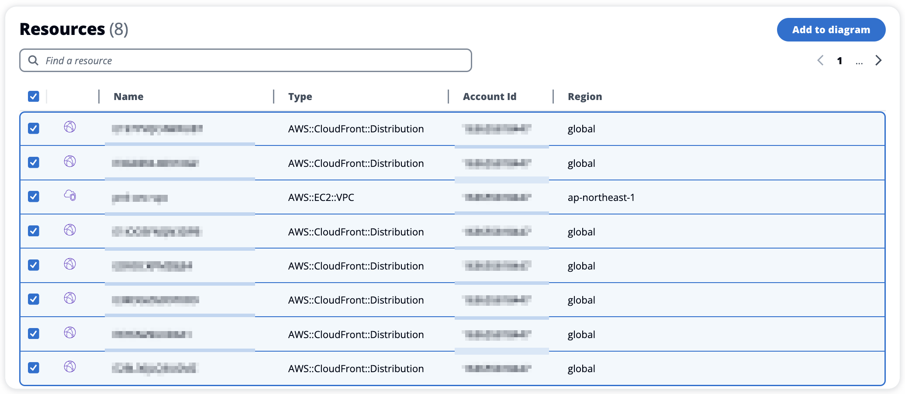

こんにちは。ITインフラ本部 SRE部の馬屋原です。

今回は、AWSクラウドのワークロードの詳細なアーキテクチャ図を出力するソリューション、Workload Discovery on AWS について紹介します。

多くのプロジェクトでは、システムの初回構築時や更新時にAWSのアーキテクチャ図を手動で作成／更新します。
そのため、アーキテクチャ図の作成／更新に時間が掛かります。
また、運用を続けていくうちにアーキテクチャ図と実際のシステムで徐々に乖離が発生するようになります。

本ソリューションを利用してアーキテクチャ図を作成することで、いつでも短時間で最新のアーキテクチャ図を作成できるようになります。

※ワークロードとは、ビジネス価値をもたらすリソースとコードの集合のことです。

※この記事では、Workload Discovery on AWS のバージョン2.1.6を前提に説明しています。

# Workload Discovery on AWS とは？
Workload Discovery on AWS とは AWSクラウドのワークロードの詳細なアーキテクチャ図を出力するソリューションです。

※公式サイト: https://aws.amazon.com/jp/solutions/implementations/workload-discovery-on-aws/

既存のAWSのアーキテクチャ図を作成する際に利用可能です。
また、リソース名やIPアドレスなどの情報を使用して、目的のリソースを横断的に検索可能です。

# 主な機能
AWS Config および AWS API の describe API コールを利用してワークロードを検出します。
検出されたリソースは本ソリューションの Web UI を通して検索／表示可能です。
検出されたリソース情報に基づいてAWSのアーキテクチャ図を作成し、ファイルへ出力可能です。

# 導入概要
Workload Discovery on AWS を利用するには、まず本ソリューションのデプロイ先となるアカウント（アドミンアカウント）を用意し、本ソリューションをデプロイします。
次に、分析対象のアカウント（ターゲットアカウント）をセットアップします。

各アカウントでの具体的なセットアップ手順は[公式サイト](https://docs.aws.amazon.com/solutions/latest/workload-discovery-on-aws/deploy-the-solution.html)をご確認ください。
CloudFormation のテンプレートが用意されているため、簡単にセットアップ可能です。

本記事では本ソリューションをセットアップする具体的な手順には触れず、本ソリューションが提供する主要な機能の1つであるアーキテクチャ図の作成に焦点を当てて説明します。

# 実践的な使用例
Workload Discovery on AWS にはいくつか機能がありますが、本記事ではアーキテクチャ図の作成に焦点を当てて説明します。

## AWSのアーキテクチャ図作成
Workload Discovery on AWS を利用して AWS のアーキテクチャ図を作成する手順は以下の通りです。

### 1. リソース情報をインポートする
対象となるアカウントおよびリージョンのリソース情報を本ソリューションへインポートします。

アーキテクチャ図に CloudFront などのグローバルサービスを含める場合はリージョンで「US East (N. Virginia)」も追加選択してください。

#### 注意事項
* 本ソリューションは AWS Config の情報をもとにリソースを検出しているため、リソースの種類によっては反映までに24時間かかります
* リソース検知は15分間隔で実行されます（毎時00分、毎時15分、毎時30分、毎時45分に実行）
* Import ボタンを押してから次回のリソース検知までは既に Import 済みのリソースも本ソリューションで一時的にアクセスできない状態になります

### 2. Diagram を作成する
Resources 画面で対象アカウントおよびリージョンを選択し、Diagram を作成します。

まずは、Resources 画面へ遷移し、対象アカウントとリージョンを選択してください。
CloudFront などのグローバルサービスを含める場合はリージョンで「global」も追加選択してください。

次に、Diagram に含めたいリソース種別を Resources types で選択してください。

ここで選択したリソースタイプにマッチするリソースが、下の Resources 一覧に追加されます。

Resources types の検索欄をクリアしても選択状態は維持されるため、必要な分だけ検索と選択を繰り返してください。

最後に、Resources 一覧に表示されているリソースのうち、Diagram に含めたいリソース全てにチェックを入れ、「Add to diagram」ボタンを押下してください。

Resources 画面で直接選択したリソース以外にも、選択したリソースに関連するリソースが自動で Diagram に追加されます。

そのため、まず Resources 画面では VPC を選択し、VPCに関連しないリソースについては必要に応じて追加選択することをお勧めします。

例として挙げると、以下のようにリソースタイプを選択するのがおすすめです。

| Resources Types |
|--|
| AWS::EC2::VPC |
| AWS::CloudFront::Distribution |

Visibility と Name を入力し、「Create」ボタンを押下してください。

Diagram の作成ユーザーのみ参照／更新可能にするには Visibility で Private を選択し、他のユーザーも参照／更新可能にするには Public を選択してください。

**Diagram を作成する際に Visibility と Name を設定できますが、Diagram 作成後はこれらの値を変更できないためご注意ください。**

#### 作成直後のDiagram

### 3. Diagram を修正する
2で作成した Diagram のままだと、重要度の低いリソースが多くて含まれた複雑なアーキテクチャ図になります。
そのため、Diagram に含めるリソースタイプを制限する修正を加えます。

まずは、Diagrams 画面へ遷移し、対象の Diagram を開いてください。

次に、Diagram Settings の Filter type で Hide Selected を選択します。
Accounts と Regions は選択不要です。

最後に、Resource Types で出力を制限するリソースタイプを複数選択し、Apply と Save を実行してください。

#### 非表示にするリソースタイプを選択

何を非表示にするかは対象サービスによって異なりますが、
例として挙げると以下のリソースタイプを非表示にするのがおすすめです。

| Resource Types |
|--|
| AWS::EC2::NetworkInterface |
| AWS::EC2::SecurityGroup |
| AWS::ECS::Task |
| AWS::RDS::DBClusterSnapshot |
| AWS::Tags::Tag |

#### 上記のリソースタイプを非表示にする前

#### 上記のリソースタイプを非表示にした後

### 4. Diagram をファイルに出力する
本ソリューションで作成した Diagram は以下の形式でファイル出力可能です。

| 出力可能な形式 |
|--|
| JSON |
| CSV |
| Draw.io |

ファイル出力後の手直しのしやすさから Draw.io 形式での出力をお勧めします。

まず、Diagrams 画面へ遷移し、対象の Diagram を開いてください。

次に、Actions -> Diagram -> Export から Diagram を draw.io 形式で出力します。

### 5. ファイル出力後に手動で調整する
本ソリューションから Export した直後のファイルでは枠線の表示が重なっているなど、見づらい状態です。

そのため、必要に応じて draw.io で調整を加えて保存し直してください。

これでAWSのアーキテクチャ図の作成が完了です。

#### 手動調整する前

#### 手動調整した後

# 注意点
月額で約425ドルの料金が発生します。(2024年04月時点の価格体系)
([Example cost tables](https://docs.aws.amazon.com/solutions/latest/workload-discovery-on-aws/cost.html#example-cost-tables))

そのため、公式ドキュメント([Cost optimization](https://aws-solutions.github.io/workload-discovery-on-aws/workload-discovery-on-aws/2.0/cost-optimization.html))に記載されているように、使用しない期間はコストを抑えるために以下の2点を実施することをおすすめします。

- ECSタスクのスケジュールを無効化
- Neptuneクラスターを停止

# まとめ
Workload Discovery on AWS を使うことで、いつでも短時間で最新のアーキテクチャ図を作成できるようになります。

これにより、保守／開発しているメンバが最新のアーキテクチャについて、より深く理解できるようになることが期待できます。

この記事を通じて、本ソリューションがどのようにアーキテクチャ図の作成やアーキテクチャの把握に効果的であるかを理解していただけたと思います。

AWSを利用しているプロジェクトでの本ソリューションの積極的な活用をお勧めします。
