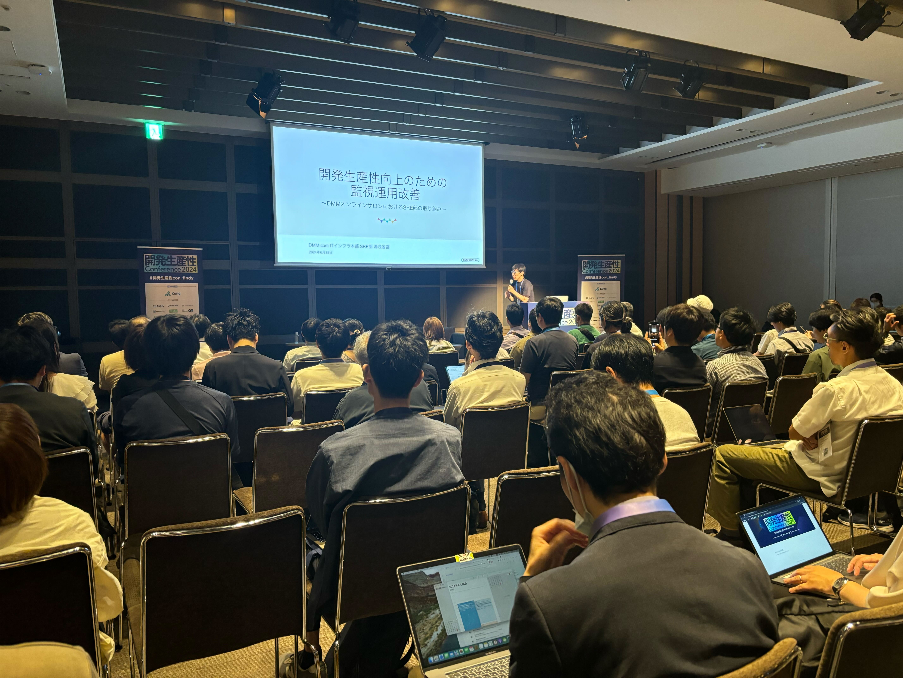
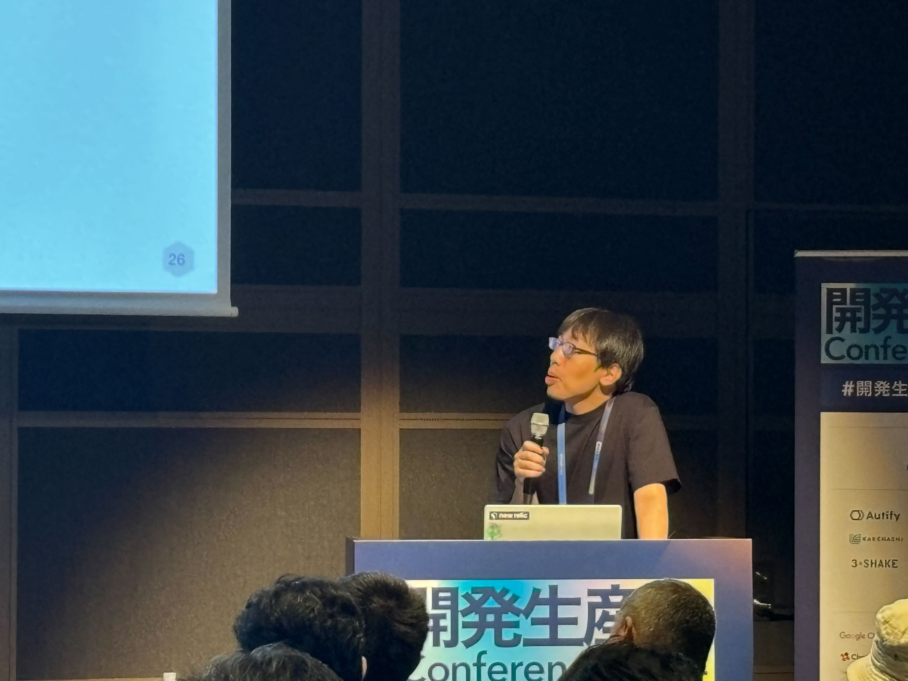
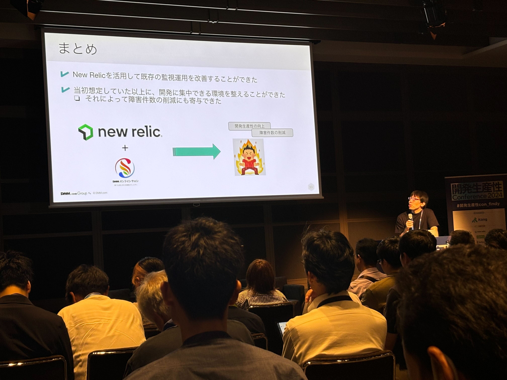
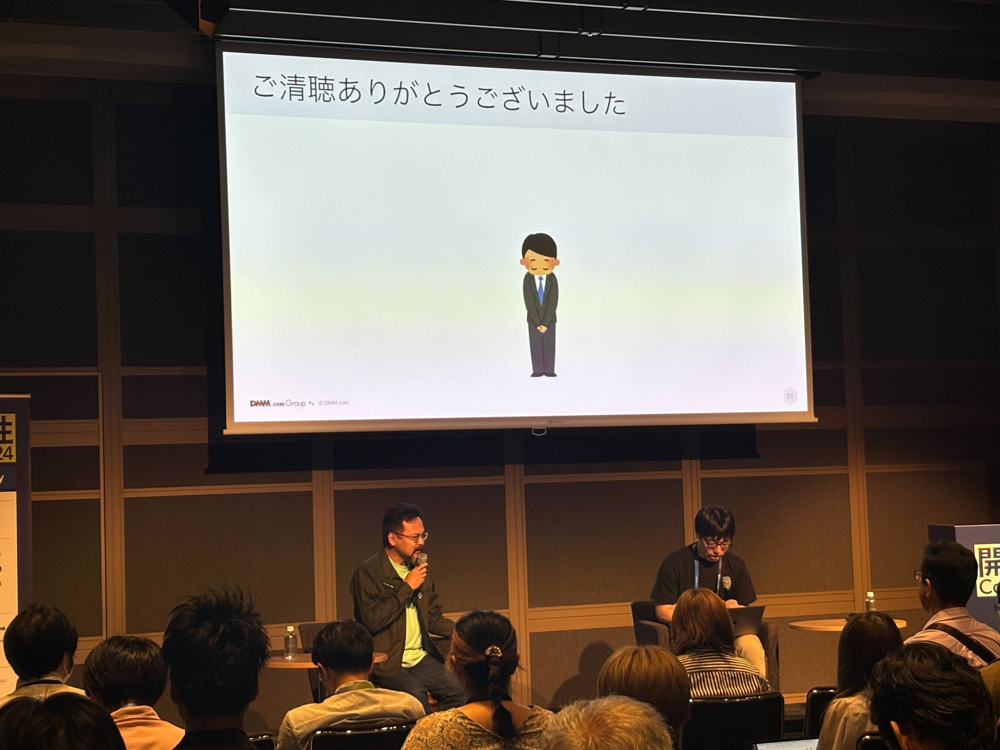
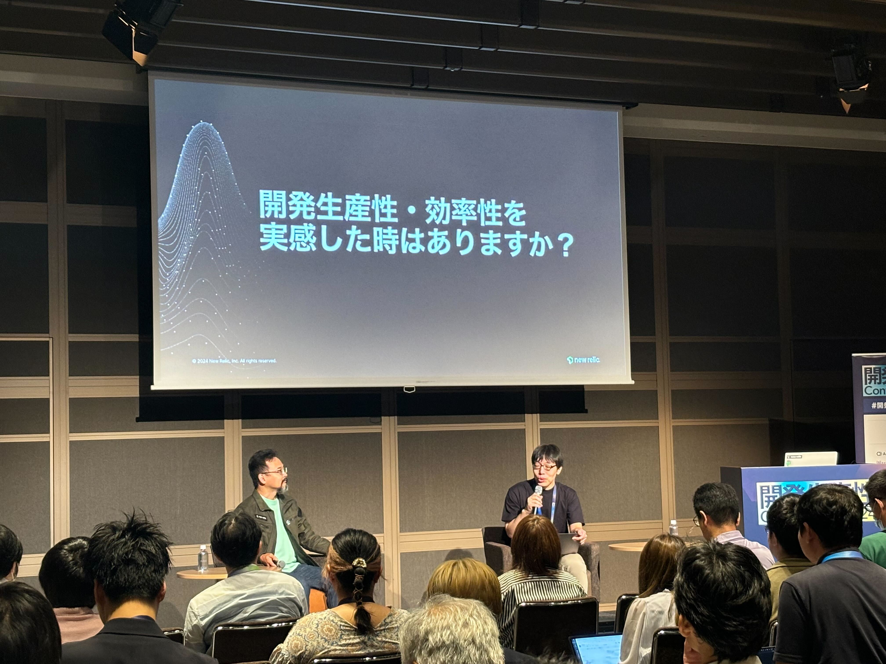

# 開発生産性向上のための監視運用の改善

## はじめに

こんちは！ ITインフラ本部 SRE部の湯浅です。

今回のブログでは、2024年6月28日に開催された、開発生産性Conference 2024にて  
「開発生産性向上のための監視運用の改善」というタイトルで登壇してきましたので  
その内容や当日の様子についてご紹介したいと思います。

## 開発生産性Conferenceとは

開発生産性Conferenceは、ファインディ株式会社が主催する、  
開発生産性をキーワードとした、ITエンジニア向けのイベントです。

以下、[開発生産性Conference](https://dev-productivity-con.findy-code.io/2024)のサイトからの抜粋です：

> エンジニア不足が叫ばれるなか、開発生産性が今注目を集めています。
> 
> 開発生産性Conferenceは、海外・日本の開発生産性に関する最新の知見が集まり、  
> 各企業のベストプラクティスや開発生産性向上への取り組みを通して、  
> 日本のエンジニアリングの向上につながることを目標とします。
> 
> 昨年7月の開催では、“開発生産性とは何か” をテーマに、その定義や進め方について切り開かれました。
> 
> 2024年は、事業インパクトにつながる開発生産性の捉え方や進め方、  
> 具体的な生産性向上に向けた施策についてもう一歩踏み出します。

イベントは２日間に渡り開催され、6月11日の時点ですでに申込者が1,300人を超えるほど、  
開催前から注目度が高かったようです。

## 登壇内容

今回はNew Relic様のスポンサーセッションの中で、  
DMMの事例を紹介するという形での発表となっています。

そのため、全体構成としては以下のような内容となっています。

- New Relic様： 開発生産性とNew Relicというツールの関連性を説明（5分程度）
- DMM: 　DMMオンラインサロンの事例を交え、監視運用を改善することで  
開発生産性がどのように向上したのかを説明（25分程度）

### 開発生産性向上のための監視運用の改善

DMMの登壇パートとしては以下のような内容で発表させていただきました。  
詳しい内容については、リンク先のスライドをご確認ください。

- DMMオンラインサロンのサービス紹介、SRE部についての紹介など
- DMMオンラインサロンで抱えていた監視運用の課題について
- New Relicを活用してどのように課題を解決していったかを紹介
- New Relicダッシュボードの活用例の紹介
- 想定していた効果と、想定していなかった副次効果について
- まとめ

### New Relic様とのQA形式でのディスカッション

登壇の最後の余った時間を使って、New Relic様からの質問に答える形でディスカッションを行いました。

**Q:導入当初の話として、慣れたツールを変更するのは大変ではなかったですか？また、朝会でダッシュボードを見るようになって変化はありましたか？**

> そもそも監視ツールが統一できていなかったということもあり、ツールを使いこなせていない部分がありました。  
> 逆にNew Relicに統一、集中することができ、朝会などで実際に見て、触って覚えていけたので、あまり大変さは感じませんでした。
> 
> また、朝会にはリーダーやマネージャーなども同席しているので、問題を見つけた時の対応判断もすぐに行うことができるようになりました。

**Q:障害件数の削減が実現されたかと思いますが、業務の中で開発生産性が向上したな、働きやすくなったなと思う瞬間はありましたか？**

> 以前は、システムの中身を詳しく知っている人に、どうしても障害対応が集中しがちでしたが、  
> New Relicを使うことで、障害時の分析や初動対応などが誰でも行えるようになりました。  
> 特定の人に偏らず対応できるようになったという点で、良くなったと思います。
> 
> また、以前は、データを集めたあとにグラフを作ったり、可視化するための資料を作る必要がありました。  
> しかし、New Relicでは、データが最初から可視化され、グラフなどに整理された状態で  
> 見ることができます。   
> その結果、第三者に説明する際に、New Reicのデータやダッシュボードを見せることで、  
> より効率的に説明できるようになったと思います。
> 
> New Relicのデータがいわば「共通言語」となって  
> New Relicを通して効率的に会話ができるようになったと思います。

**Q:ダッシュボードをうまく活用されていたと思いますが、作る上で気をつけたポイントなどはありますか？**

> 作る時にあまり情報を載せすぎないように、まずはサービスとして見るべき優先度の高いものに絞って  
> ダッシュボードに載せていくような工夫を行いました。

**Q:最後にDMMのSRE部として今後力を入れていきたいポイントはありますか？**

> 今回の事例のように、New Relicを使って開発に集中しやすい環境が整えられたと思っていますし  
> DMMオンラインサロンに限らず、そのような取り組みが社内で当たり前になってきています。  
> 
> 今後は、開発しやすい環境に加えて、SLOを使って「ユーザー目線で満足できるようなシステムの実現にも  
> 力をいれていきたいと思っています
> 
> また、全社的に活用できるようなツールやプラットフォームの開発も行ったりしているので  
> サービスの「縁の下の力持ち」となる部分だけでなく、全社の役に立つようなモノづくりの部分も  
> どんどんやっていきたいと思っていますので、  
> そういったことに興味のある方は、ぜひ、DMMで一緒にやりましょう

### SNSでの反応

今回のイベントは現地の参加者の熱量もすごかったですが、  
SNSも大変盛り上がっていました。

今回の登壇に関しても、SNS上でいくつもポジティブなコメントをいただいており
大変うれしかったです。

- 監視ツールを眺める会いいな、真似したい
- チェンジトラッキング（デプロイメントマーカー）いいな、変更による影響がわかりやすい！
- ダッシュボード例、勉強になる
- アラートが出たときに初動の手順がすぐにわかるの大事
- （Runbookとか参考になる取り組みについて）うちでもいくつかできそうだから、持ち帰ろう

## おわりに

今回のような大規模イベントでの登壇は初めてだったので、  
「みんなに響かなかったらどうしよう」という  不安はありましたが、蓋を開けてると、  
SNSのコメントだけでなく、  登壇のあと Ask the Speakerという質問ブースでも、  
「勉強になりました」「ぜひ資料公開してほしいです！」といったコメントもいただけて、  
とても自信になりました。

今回の登壇でとても良い経験ができたと感じましたし、もし「登壇してみたいけど自信がない」と言う方は
勇気を振り絞って、ぜひチャレンジしてみてほしいと思います。

また、今回は業務都合で他のセッションを聴きに行ったり、ブースを回ったりできませんでしたが  
おもしろいセッションが数多くあり、直接話を聞けるブースもあるので、次回はぜひ  
参加者としても現地に行きたいと思います。