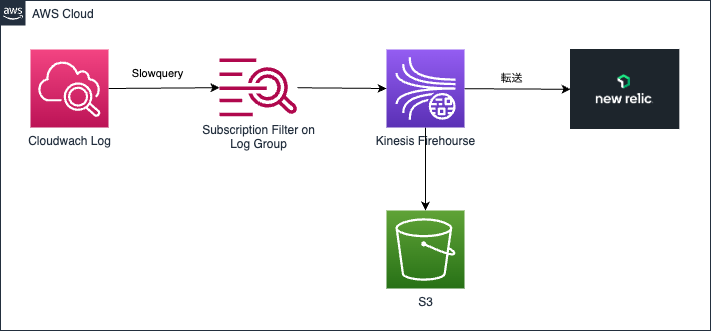

# AWS Aurora MySQL　のslowqueryログをNewRelicで分析する方法
 
こんにちは。ITインフラ本部 SRE部の小野です。

データベースのパフォーマンスを最適化するためには、スロークエリを検出し、適切に対処することが重要です。
NewRelicのAPM（Application Performance Monitoring）を利用することで、スロークエリの監視が可能ですが、サンプリングされるため、全てのスロークエリを把握することはできません。
また、プリペアドステートメントの形式で表示されるため、実際遅かったクエリ内容の理解が難しい場合もあります。

本記事では、AWS Aurora MySQLのスロークエリをNewRelicに送信する方法について、Terraformを用いた実装を交えて解説します。

# 前提条件
* RDSインスタンスは構築済みでスロークエリログもCloudWatch Logsに出力済み
* Terraformのインストールも完了済み

# 完成構成図
下記の手順を実施すると以下のリソースが作成されます



# 手順

## 1. S3バケットの作成

Amazon Data FirehoseのためのS3バケットを作っておきます。

```hcl
resource "aws_s3_bucket" "this" {
  bucket = "slowlog-s3"
}
```

## 2. IAMロールの作成
Amazon Amazon Data FirehoseとAWS CloudWatch Logs Subscription Filters(以下、CloudWatch)で利用するIAMロールを事前に作成しておきます。

```hcl
#-------------------------------------------------
# Kinesis側設定
#-------------------------------------------------
resource "aws_iam_role" "kinesis" {
  name               = "slowlog-kinesis-role"
  path               = "/service-role/"
  assume_role_policy = data.aws_iam_policy_document.kinesis.json
}

data "aws_iam_policy_document" "kinesis" {
  statement {
    actions = ["sts:AssumeRole"]

    principals {
      type        = "Service"
      identifiers = ["firehose.amazonaws.com"]
    }
  }
}
```

```hcl
#-------------------------------------------------
# CloudWatch Logs側設定
#-------------------------------------------------
resource "aws_iam_role" "cloudwatch" {
  name               = "slowlog-cloudwatch-role"
  path               = "/service-role/"
  assume_role_policy = data.aws_iam_policy_document.cloudwatch.json
}

data "aws_iam_policy_document" "cloudwatch" {
  statement {
    actions = ["sts:AssumeRole"]

    principals {
      type        = "Service"
      identifiers = ["logs.ap-northeast-1.amazonaws.com"]
    }
  }
}

resource "aws_iam_role_policy_attachment" "cloudwatch" {
  role       = aws_iam_role.cloudwatch.name
  policy_arn = aws_iam_policy.cloudwatch.arn
}

resource "aws_iam_policy" "cloudwatch" {
  name        = "slowlog-cloudwatch-policy"
  path        = "/"
  description = "firehose-log"

  policy = jsonencode({
    Version = "2012-10-17"
    Statement = [
      {
        Action = [
          "firehose:ListDeliveryStreams",
        ]
        Effect = "Allow"
        Resource = [
          "*",
        ]
      },
      {
        Action = [
          "firehose:*",
        ]
        Effect = "Allow"
        Resource = [
          aws_kinesis_firehose_delivery_stream.this.arn
        ]
      }
    ]
  })
}
```

## 2. 送信用のKinesis　を作成する
NewRelicと連携するためのAmazon Amazon Data Firehose(以下、Kinesis)を作成します。
NewRelicに送信するためにはライセンスキーが必要になります。NewRelicの管理画面でKeytypeを「ingest - License」で作成する必要があります。
今回の例ではAWS Systems Manager Parameter Storeにセットした状態になっています。


```hcl
# NewRelic License Key
data "aws_ssm_parameter" "this" {
  name = "newrelic-license-key"
}

resource "aws_kinesis_firehose_delivery_stream" "this" {
  name        = "slowlog"
  destination = "http_endpoint"

  http_endpoint_configuration {
    url                = "https://aws-api.newrelic.com/firehose/v1"
    name               = "New Relic"
    access_key         = data.aws_ssm_parameter.this.value
    buffering_size     = 1
    buffering_interval = 60
    role_arn           = aws_iam_role.kinesis.arn

    s3_configuration {
      role_arn           = aws_iam_role.kinesis.arn
      bucket_arn         = aws_s3_bucket.this.arn
      buffering_size     = 10
      buffering_interval = 400
      compression_format = "GZIP"
    }

    request_configuration {
      content_encoding = "GZIP"
    }
  }
}
```

## 3. CloudWatch LogsをKinesisに転送する

CloudWatchを使ってKinesisにログを転送します。
複数のログを送りたい場合は、for_eachを使って対象を指定してあげます。

```hcl
locals {
  slowlogs = toset([
    "/aws/rds/cluster/cluster1/slowquery",
    "/aws/rds/cluster/cluster2/slowquery",
  ])
}
```

```hcl
resource "aws_cloudwatch_log_subscription_filter" "this" {
  for_each = local.slowlogs

  name            = "slowlog-${each.key}"
  log_group_name  = each.key
  filter_pattern  = ""
  destination_arn = aws_kinesis_firehose_delivery_stream.this.arn
  role_arn        = aws_iam_role.cloudwatch.arn
}
```

以上でAWS側の設定は終了です。

## 4. NewRelicでのParsingRuleの追加

Slowlogが出力されて一定時間（今回の設定では１分程度）立つとNewRelic側でデータが参照できるようになります。

この時点ではLogテーブルに保存はされていますが、messageフィールドにすべての値が埋め込まれているため簡単に分析ができません。
そこでmessageフィールドの値をパースして分析しやすい形に変更する必要があります。

[Logs] - [Parsing]から[Create Parsing rule]をクリックし以下の設定を行ってください

* Name
    * <任意の識別子>
* Field to parse
    * message
* Filter logs based on NRQL
    * logGroup like '/aws/rds/cluster/%'
* Parsing rule
    ```
    # Time: %{TIMESTAMP_ISO8601:timestamp}\n# User@Host: %{DATA:user}\n# Query_time: %{NUMBER:query_time}  Lock_time: %{NUMBER:lock_time} Rows_sent: %{NUMBER:rows_sent}  Rows_examined: %{NUMBER:rows_examined}\n(?s)%{GREEDYDATA:query}
    ```

この設定をすることで保存した以降のログが正しく分析できるようになります

## 5. NRQLでの取得

データはLogテーブルに保存されているため以下のNRQLで取得できるようになります

```
FROM Log SELECT timestamp, logGroup,logStream,query_time,rows_examined,rows_sent,user,query WHERE logGroup IN ('<logグループ名>','<logグループ名>') 
```

各項目の説明は以下を参照してください


| 項目名           | 説明                                                                 |
|------------------|----------------------------------------------------------------------|
| `timestamp`      | ログエントリが記録された日時                                          |
| `logGroup`       | スローログが発生したRDSクラスターIDを含むロググループ名                   |
| `logStream`      | スローログが発生したRDSインスタンスのID                                 |
| `query_time`     | クエリの実行にかかった時間（ミリ秒単位）                               |
| `rows_examined`  | クエリ実行中に検査された行の数                                       |
| `rows_sent`      | クエリの結果として返された行の数                                      |
| `user`           | クエリを実行したデータベースユーザー名                                 |
| `query`          | 実行されたSQLクエリの全文                                             |

## 6. まとめ

ここまで、AWS Aurora MySQLのスロークエリログをNew Relicへ分析しやすい形で送信する方法をお伝えしてきました。

SRE部では担当しているサービスのスロークエリログを見て定期的に改善できるSQLは無いかをチェックしています。

パフォーマンスチューニングを行う上で遅いSQLを特定し、その原因を分析することは非常に重要です。スロークエリログを分析することで、データベースのパフォーマンスを継続的に改善し、サービスの信頼性を高めるための貴重な情報を得ることができます。

