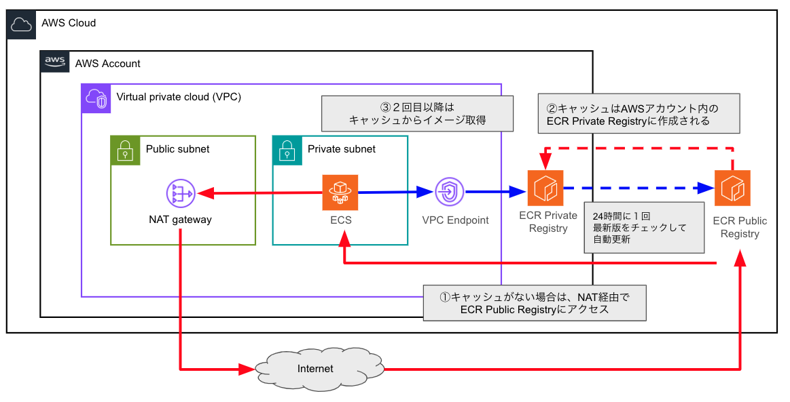
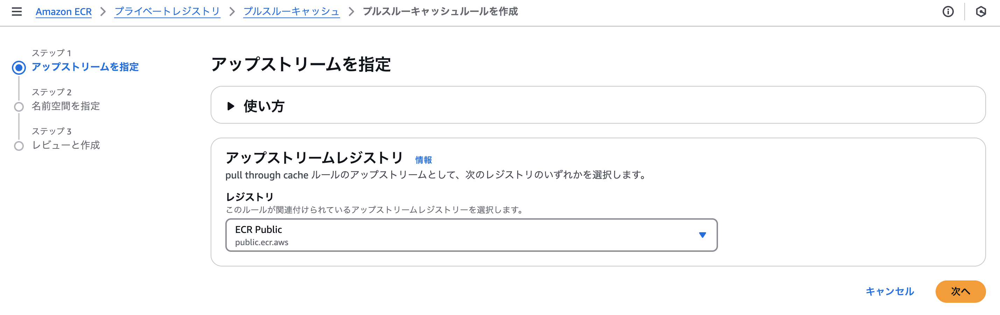
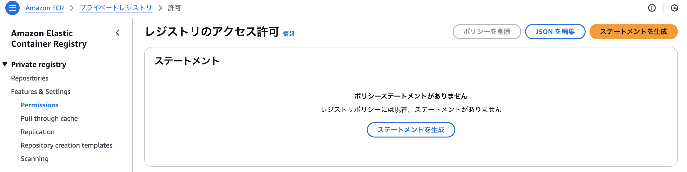
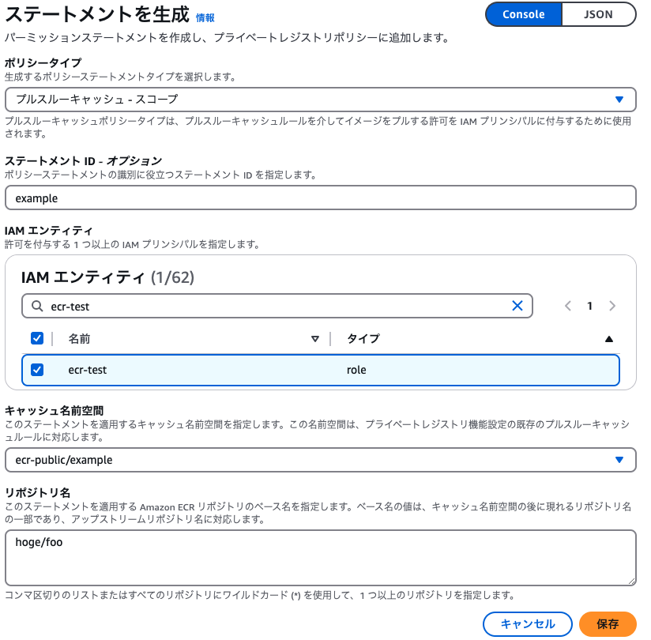
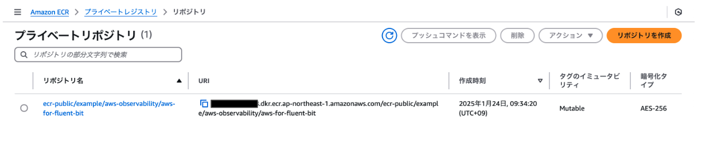

# ECR プルスルーキャッシュを使ってみた
 
こんにちは。ITインフラ本部 SRE部の湯浅です。

本記事では、AWS Elastic Container Registry (以下、ECR)の機能の１つである、  
プルスルーキャッシュリポジトリ機能の使い方についてご紹介していきます。  

AWSでは、NAT Gateway 経由でインターネット通信する場合に、  
そのデータ通信量の課金によってコストがかさむ、ということがよくあると思います。  

このプルスルーキャッシュリポジトリ機能を使うことで、  
特に、パブリックなコンテナイメージをインターネット上から取得してくるケースにおいて  
コスト削減に活用できます。

# ECRのプルスルーキャッシュリポジトリ　とは

ECRのプルスルーキャッシュリポジトリとは、Docker Hubや  
その他のパブリックコンテナイメージリポジトリのイメージを、  
AWS内にキャッシュして利用することができる仕組みのことです。

### NAT Gatewayを介したインターネット通信の分析について

NAT Gatewayを介したインターネット通信がどれぐらい発生しているのか、  
そして、具体的にどこに通信しに行っているのか、といった情報は  
VPCフローログの情報から確認することができます。  

VPCフローログを使ったNAT Gateway通信の分析方法については、本記事では触れませんが、    
通信先の情報として、以下のサイトへのアクセスがあった場合、  
プルスルーキャッシュリポジトリ機能により、コスト削減できる可能性があります。  

- `d5l0dvt14r5h8.cloudfront.net.`: パブリックECRのコンテナイメージを配信しているサイト
- `production.cloudflare.docker.com.`:  Docker hubのコンテナイメージを配信しているサイト

（参考）[CloudWatch LogsでのNAT Gateway通信ログ分析のサンプルクエリ](https://docs.aws.amazon.com/ja_jp/AmazonCloudWatch/latest/logs/CWL_QuerySyntax-examples.html#CWL_QuerySyntax-examples-NATGateway)

# プルスルーキャッシュリポジトリ機能の全体イメージ

プルスルーキャッシュリポジトリの全体イメージは以下のとおりです。

1. 初回は、NAT Gateway経由 で ECR Public Registry からイメージ取得
2. AWSアカウント内に ECR Private Registry を使ったイメージキャッシュが作成される
3. 二回目以降は、VPCエンドポイント経由でキャッシュからイメージ取得を行う



なお、VPCエンドポイントについては、以下を設定しておいてください。

- com.amazonaws.${region}.ecr.dkr
- com.amazonaws.${region}.ecr.api
- com.amazonaws.${region}.s3

※ `${region}` はご自身の環境のリージョン名として読み替えてください


# プルスルーキャッシュの設定方法

それでは、具体的なプルスルーキャッシュの設定方法について説明します。

キャッシュ可能なパブリックレジストリとして、`Docker Hub` や `GitHub コンテナレジストリ`など、  
複数のレジストリが対応していますが、今回は、`ECRパブリックレジストリ` の場合を例に挙げて説明します。

この、`ECRパブリックレジストリ` とは、 AWSがパブリックに公開している、認証なしで  
イメージ取得ができる `public.ecr.aws` のようなドメインで始まるものを指しています。

プルスルーキャッシュを利用するにあたって、大きくは以下の２つが必要となります。

- プルスルーキャッシュルール の作成
- キャッシュ用レジストリ操作のための権限付与

## プルスルーキャッシュルール の作成

設定方法として、今回は、AWS Webコンソールでの設定方法と、  
Terraformでの設定方法を紹介します。

### AWS Webコンソールから設定する場合

Amazon ECR の画面のプライベートレジストリのメニューで  
 `Features & Settings` の `Pull through cache` にある  
`ルールの追加` ボタンから設定を行います。


1. アップストリームレジストリ の設定で `ECR Public` を選択してください。



2. `キャッシュ名前空間` の `キャッシュリポジトリプレフィックス` で任意のネームスペースを指定してください。
   - デフォルトは `ecr-public` です
   - その下でさらに細かくパスで分けることも可能です（複数システム共存していて分割したい場合など）
     - 例） ecr-public/example


3. 設定確認画面が出てくるので、問題なければ作成ボタンを押して完了です。

### Terraform から作成する場合

以下のようにTerraformから作成することも可能です。
`ecr_repository_prefix` の値については、任意の名前空間を設定してください。

```
resource "aws_ecr_pull_through_cache_rule" "this" {
    ecr_repository_prefix = var.ecr_ptc_name_space # 任意のキャッシュ名前空間
    upstream_registry_url = "public.ecr.aws"
}
```

※ バージョンは、terraform: 1.10.4, aws_provider: 5.84.0 で検証しています

## キャッシュ用レジストリ操作のための権限付与

プルスルーキャッシュは、イメージをキャッシュするための
`プライベートレジストリの作成` が必要となるため、その権限が必要なります。

具体的には、以下のようなポリシー（権限）が必要になります。

```
ecr:CreatePullThroughCacheRule
ecr:BatchImportUpstreamImage
ecr:CreateRepository
```

### プルスルーキャッシュのポリシーの設定箇所

プルスルーキャッシュのポリシーは以下のいずれかに必ず設定してください。  
※ 権限が不足していると、キャッシュ経由でのイメージ取得に失敗します

#### 設定方法 1. IAMユーザー/ロールへのポリシー設定

  - 他のIAM権限と同様に、ユーザーまたはロール単位で権限を設定します。

#### 設定方法 2.  ECRプライベートレジストリへのポリシー設定

  - リポジトリ単位での権限設定となります。
  - クロスアカウントで、外部のAWSアカウントからの権限を許可したい場合などは、こちらに設定します。

上記1. の設定方法は、一般的なIAMユーザー/ロールでの設定方法と同じですので割愛します。  
今回は、上記2. の設定方法について紹介します。

##### AWS Webコンソールから設定する場合

1. Amazon ECR の画面のプライベートレジストリのメニューで`Features & Settings` の `Permissions` を開き、`ステートメントを作成` ボタンから設定を行います。



2. ポリシーステートメント設定画面で、パラメータを設定してください。

- `ポリシータイプ`: `プルスルーキャッシュ-スコープ` を設定
- `ステートメントID`: 任意のステートメントIDを設定
- `IAMエンティティ`: アクセスを許可するIAMユーザー/ロール を設定（たとえばECSなら、ECSタスク実行ロールを指定）
- `キャッシュ名前空間`: 前述で作成したプルスルーキャッシュの名前空間を設定
- `リポジトリ名`: アクセス先となるリポジトリ名を設定


なお、`リポジトリ名` は、IAMポリシーの Resouce に対応する項目なので、通常、ワイルドカードが指定できますが、  
GUI上ではパス内にワイルドカード（＊）を含めると、入力チェックエラーでうまく設定できないようです。  
ワイルドカードを含めたい場合は、JSON形式であれば編集、保存が可能でした。（2025/1/24 時点）

   例） "arn:aws:ecr:ap-northeast-1:xxxxxxxxxxxx:repository/ecr-public/example/*"
 


##### Terraform から作成する場合

ECRプライベートレジストリのポリシー設定のTerraformでの設定例は  
以下のとおりです。

`Principal` および `Resource` の部分は実際に利用するロール名やリソースと読み替えてください。

```
resource "aws_ecr_registry_policy" "this" {
    policy = jsonencode({
        Version = "2012-10-17",
        Statement = [
            {
                "Effect": "Allow",
                "Principal": {
                    "AWS": "arn:aws:iam::XXXXXXXXXXXX:role/ecsExecutionRole"
                },
                "Action": [
                    "ecr:CreateRepository",
                    "ecr:BatchImportUpstreamImage"
                ],
                "Resource": [
                    "arn:aws:ecr:ap-northeast-1:XXXXXXXXXXXX:repository/ecr-public/example/*"
                ]
            }
        ]
    })
}
```

# プルスルーキャッシュを使うためのイメージURL読み替えについて

今まで利用していた `ECRパブリックレジストリ` のイメージを、プルスルーキャッシュ経由で利用するには  
利用するアプリケーション側で、URLの読替えが必要になります。

## 読み替え例

以下は、AWS fluent-bit の公式イメージを利用する場合の例です

- `xxxxxxxxxxxx` は、自身のAWSアカウントIDと読み替えてください
- `ecr-public/example/` はプルスルーキャッシュの名前空間です
- `public.ecr.aws/<イメージパス>` → `xxxxxxxxxxxx.dkr.ecr.ap-northeast-1.amazonaws.com/<ネームスペース>/イメージパス` のような読み替えになります

| 読み替え前/後 | イメージURL |
| --- | --- |
| 読み替え前 | `public.ecr.aws/aws-observability/aws-for-fluent-bit:2.23.3` |
| 読み替え後 | `xxxxxxxxxxxx.dkr.ecr.ap-northeast-1.amazonaws.com/ecr-public/example/aws-observability/aws-for-fluent-bit:2.23.3` |


# 実際に作成されるキャッシュレジストリについて

プルスルーキャッシュの機能を使って、実際にイメージがキャッシュされると、  
以下のようにプライベートレジストリが作成されます。



# キャッシュイメージの自動更新について

キャッシュされたイメージは、少なくとも24時間に1回、最新版かどうかの確認、更新が行われます。  
そのため、latestタグなど、内部的にバージョンが固定されないようなバージョン指定で  
利用している場合は、そのイメージが裏で自動更新されている可能性がありますのでご注意ください。


参考： [AWS公式ドキュメント](https://docs.aws.amazon.com/ja_jp/AmazonECR/latest/userguide/pull-through-cache.html)より
```
特定のタグが付いている、キャッシュされたイメージの後続のプルリクエストでは、
Amazon ECR はアップストリームレジストリをチェックして、  
その特定のタグを持つイメージの新しいバージョンがあるかどうかを確認し、
プライベートレジストリ内のイメージの更新を少なくとも 24 時間に 1 回試みます。
```

# まとめ

このように、ECR の プルスルーキャッシュリポジトリ機能 によって  
コンテナイメージをキャッシュでき、さらにVPCエンドポイントと組み合わせることで  
NAT Gatewayの通信コスト削減が期待できます。  
設定も簡単ですので、ぜひ、この機能を活用してみてください。
