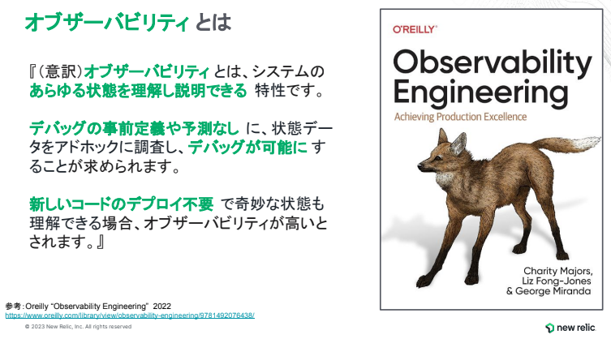
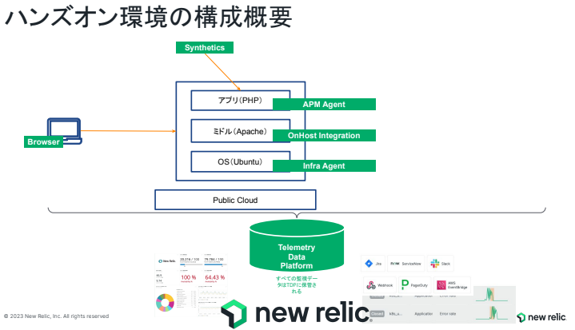
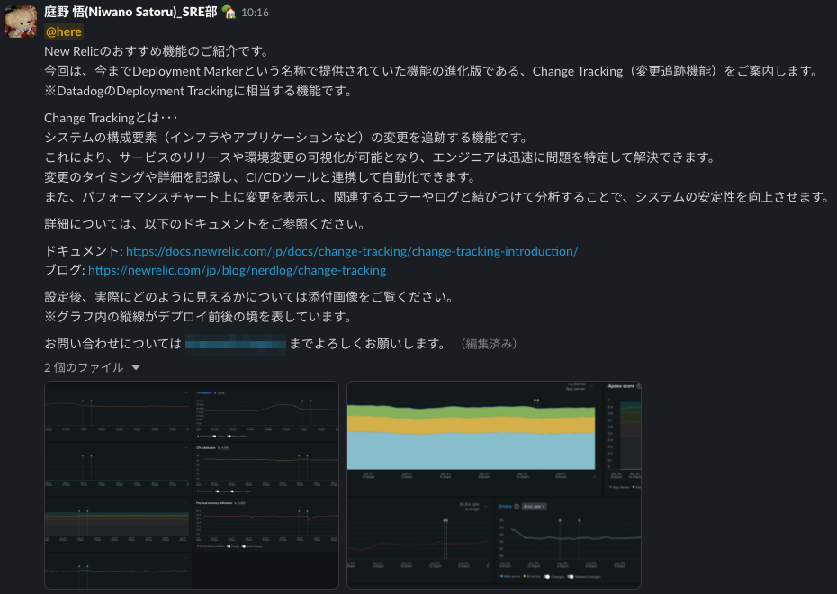
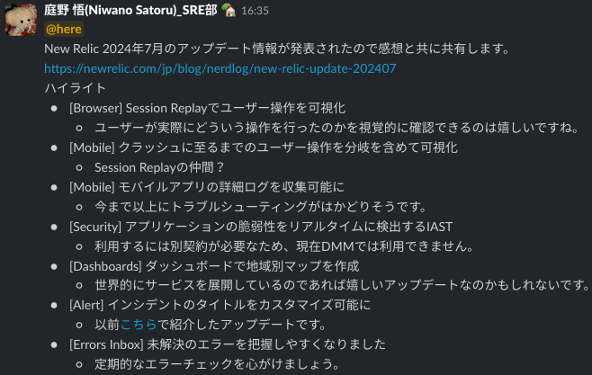
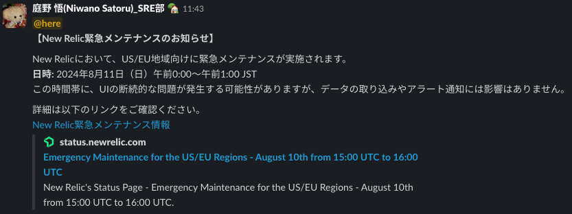

こんにちは。ITインフラ本部 SRE部の庭野です。  
本記事では、私たちSRE部が進めるNew Relic導入活動の一環である、社内情報発信活動についてご紹介します。

---

## New Relic導入活動の背景

DMMでは、各サービスが独自の運用方針に基づき、最適なモニタリングツールを選定・運用しています。  
2019年、当時のCTOの方針により、モニタリングツールをDatadogに統一する動きがあり、一部のサービスではDatadogの導入が進められました。  
しかし、事業の拡大やサービスごとの要件の多様化に伴い、モニタリングツールの選択肢を広げる必要性が高まりました。  

こうした背景から、SRE部ではNew Relicの導入を推進し、より柔軟に各サービスの要件に対応できるモニタリング環境を整備しています。  
現在、Datadog、New Relic、クラウドベンダーのモニタリングツールなど、さまざまなツールが併存しており、各サービスはそれぞれのインフラ環境や運用方針に最適なモニタリングを行っています。

---

## New Relicとは？

New Relicは、システムの可視化を強化し、障害対応の迅速化と安定運用を支援するオブザーバビリティプラットフォームです。  
APM（アプリケーションパフォーマンス監視）、インフラ監視、ログ管理、ブラウザ監視、モバイル監視など、さまざまな機能を提供し、システム全体の状態をリアルタイムで一元管理できます。

---

## 社内への情報発信活動

New Relicの導入を成功させ、社内での活用を広げるには、エンジニアにそのメリットや機能を理解してもらうことが不可欠です。  
そのため、SRE部では以下のような情報発信活動を行っています。

### 1. New Relicを活用するための社内勉強会

エンジニアのスキル向上を促進し、New Relicの活用を定着させるために、社内勉強会を開催しています。  
この勉強会は、New Relic社の協力のもと、New Relicのエキスパートから最新の機能やベストプラクティスを学べる場となっています。

勉強会の形式は、以下の2種類を組み合わせています。

- **座学形式**  
  New Relicの基本的な機能や設定方法、ベストプラクティスを解説します。  
  導入の全体像や活用のメリットを知る場として、エンジニアの知識向上をサポートしています。  

  昨年は、オブザーバビリティの概念を学ぶ講義が実施されました。講義では、オブザーバビリティの定義や役割、従来の監視手法との違いについて解説され、特に分散アーキテクチャにおけるオブザーバビリティの重要性に焦点が当てられました。  
  また、アプリケーション開発におけるオブザーバビリティの活用例や、主要な要素（メトリクス・ログ・トレース）をどのように活用するかについても説明がありました。これにより、リアルタイムでシステムの状態を可視化し、迅速な障害対応を可能にする手法について理解を深めることができました。

  

- **ハンズオン形式**  
  実際にNew Relicを操作しながら、具体的なシナリオに沿った実践的なスキル習得を目指します。  
  例えば、サービスのパフォーマンス可視化やアラート設定など、現場での課題解決に即した実践的な学びを提供しています。

  

---

### 2. New Relicに関する社内情報発信

New Relicの効果的な活用を促進するため、SRE部ではSlackを通じてNew Relicに関する最新情報や活用ノウハウを発信しています。  
この情報発信には以下のようなトピックが含まれます。

#### **1. おすすめ機能紹介**
New Relicの便利な機能をピックアップし、活用方法や具体的なメリットを紹介しています。  
エンジニアが現場で活用しやすいよう、実務に役立つポイントを共有しています。

  

#### **2. アップデート情報**
New Relicが毎月公開する公式アップデート情報をもとに、特に重要な機能追加や改善点をピックアップして社内に共有しています。  
最新機能を素早く活用できるよう、活用ポイントなどを添えて紹介し、効率的なキャッチアップを支援しています。

  

#### **3. メンテナンス情報**
New Relicの定期メンテナンスやシステム変更のスケジュールを社内に共有し、事前に把握できるようにしています。  
特に影響の大きい変更点については、事前の注意喚起を行い、運用への影響を最小限に抑えるための対応策も併せて案内しています。

  

---

### 3. Slackでのサポート体制

New Relicの活用を支援するため、Slack上に問い合わせ窓口を設置しています。  
このチャンネルにはNew Relicの担当者も参加しており、エンジニアが気軽に質問やトラブルを相談し、直接アドバイスを受けることができます。

さらに、最新の情報やベストプラクティスも随時共有されており、実務に役立つ知見が得られます。  
寄せられた質問にも適切に対応しており、課題解決に繋がるケースが増えています。

---

## 今後の取り組み

今後もNew Relicの導入促進を進めるため、以下の施策を予定しています。

- **社内勉強会の拡充**  
  エンジニアが自分の業務に即した形でNew Relicを活用できる実践的な内容を提供し、スキル向上を目指します。
- **導入事例の横展開**  
  各サービスでの成功事例を共有し、他チームへの展開を促進します。
- **オブザーバビリティ文化の醸成**  
  モニタリングの活用を促進し、全社的なオブザーバビリティの成熟を目指します。

---

## まとめ

SRE部では、New Relicの導入推進を通じて、DMM全体のオブザーバビリティ向上とシステム運用の最適化を目指しています。  
社内勉強会や情報発信活動を通じて、エンジニアがNew Relicを理解し、効果的に活用できるよう支援していきます。  
今後も学びの機会を積極的に提供し、オブザーバビリティの向上に取り組んでいきます。

SRE部では、一緒に働く仲間を募集しています。ご興味のある方はこちらへ！  
https://dmm-corp.com/recruit/engineer/3884
