# AWS NAT Gatewayの通信分析とコスト最適化

- [AWS NAT Gatewayの通信分析とコスト最適化](#aws-nat-gatewayの通信分析とコスト最適化)
  - [はじめに](#はじめに)
  - [背景](#背景)
  - [NAT Gatewayの通信分析](#nat-gatewayの通信分析)
    - [調査のために必要なリソース構成](#調査のために必要なリソース構成)
    - [調査1: AWS内の通信](#調査1-aws内の通信)
      - [AWS内通信の調査結果例](#aws内通信の調査結果例)
    - [調査2: AWS以外との通信](#調査2-aws以外との通信)
      - [AWS以外との通信調査結果例](#aws以外との通信調査結果例)
  - [NATゲートウェイの通信量削減案](#natゲートウェイの通信量削減案)
    - [案1: VPCエンドポイントの作成](#案1-vpcエンドポイントの作成)
    - [案2: 通信内部化](#案2-通信内部化)
    - [案3: VPC Peeringの活用](#案3-vpc-peeringの活用)
    - [案4: Docker Pullの通信を削減](#案4-docker-pullの通信を削減)
  - [まとめ](#まとめ)


## はじめに
こんにちは。ITインフラ本部SRE部の佐々木です。
本記事では、AWSのコスト最適化の手段として、NAT Gatewayの通信内容を調査し、削減する方法を紹介させていただきます。

## 背景
私が担当する「とあるプロダクト」において、AWS Cost Explorerを用いたコスト分析を行ったところ、「EC2 - その他」のカテゴリが最も高額であることが判明しました。


「EC2 - その他」の内約を確認すると、その多くが「APN1 - NatGateway - Bytes（東京リージョンのNAT Gatewayのデータ処理料金）」によるものでした。


つまり、NATゲートウェイの通信量を削減することで、AWSコストの大幅な削減が可能です。

## NAT Gatewayの通信分析

### 調査のために必要なリソース構成
`AWS Cost Exploer`や`Cloud Watch`の情報だけでは、NAT Gatewayの詳細な内容を調査することはできません。

NAT Gatewayの通信を調査するには、以下のリソースを活用します。

- `VPCフローログ`: NAT Gatewayの通信先のIPアドレスを記録
- `Route53クエリログ`: DNS解決結果を記録し、通信先のドメインを特定


参考までに、これらを構築するためのTerraformのサンプルコードを記載します。
なお、VPCはすでに存在しているものとします。

> [!NOTE]
> 長くなるので、コードを載せるべきか迷っています。
> リポジトリを公開できればそのリンクを貼りたいが....


### 調査1: AWS内の通信
まずVPC内のリソースが、NAT Gatewayを経由して、AWSのサービスと通信するトラフィック量を確認します。以下のクエリをAthenaで実行し、通信先AWSサービスごとの通信量を分析します。

**VPC内部のリソースからNAT Gatewayを経由してAWSサービスに送信した通信量**
```sql
SELECT
  pkt_dst_aws_service,
  SUM(bytes) AS "Bytes/day",
  ROUND(SUM(bytes) * 30.0 / (1024 * 1024 * 1024)) AS "GB/month",
  ROUND(SUM(bytes) * 30.0 / (1024 * 1024 * 1024) * 0.062) AS "$/month"
FROM
  example.vpc_flowlogs
WHERE
  srcaddr LIKE '172.16.%' -- VPCのCIDRのネットワーク部分
  AND dstaddr in ('172.16.0.100','172.16.1.100') --NATゲートウェイのローカルIP
  AND action = 'ACCEPT'
  AND year = 2025 AND month = 1 AND day = 1 -- 分析対象の日付
GROUP BY
  pkt_dst_aws_service
ORDER BY
  "Bytes/day" DESC
```

**VPC内部のリソースがNAT Gatewayを経由してAWSサービスから受信した通信量**
```sql
  SUM(bytes) AS "Bytes/day",
  ROUND(SUM(bytes) * 30.0 / (1024 * 1024 * 1024)) AS "GB/month",
  ROUND(SUM(bytes) * 30.0 / (1024 * 1024 * 1024) * 0.062) AS "$/month"
FROM
  example.vpc_flowlogs
WHERE
  pkt_dstaddr LIKE '172.16.%' -- VPCのCIDRのネットワーク部分
  AND dstaddr in ('172.16.0.100','172.16.1.100') -- NAT GatewayのローカルIP
  AND action = 'ACCEPT'
  AND year = 2025 AND month = 1 AND day = 1 -- 分析対象の日付
GROUP BY
  pkt_src_aws_service
ORDER BY
 "Bytes/day" DESC
```

なお、VPCフローログは非常にデータ量が多いため、このクエリでは1日分のログを集計し、その結果を単純に30倍して月間の概算通信量として算出しています。

#### AWS内通信の調査結果例

| #  | pkt_dst_aws_service  | Bytes/day       | GB/month | $/month |
|---:|:---------------------|----------------:|---------:|--------:|
| 1  | -                    | 329,324,558,249 |  9,201.0 |   570.0 |
| 2  | EC2                  | 293,154,580,089 |  8,191.0 |   508.0 |
| 3  | CLOUDFRONT           |  25,283,836,498 |    706.0 |    44.0 |
| 4  | S3                   |   9,883,647,552 |    276.0 |    17.0 |
| 5  | AMAZON               |   1,725,014,613 |     48.0 |     3.0 |
| 6  | GLOBALACCELERATOR    |         656,437 |      0.0 |     0.0 |

※ `pkt_dst_aws_service`が`-`となっている通信は、AWSサービスではないIPに向けた通信です。

### 調査2: AWS以外との通信
次に、AWS以外の通信を調査します。VPCフローログでは通信先のIPしか分からないため、Route53クエリログを活用して通信先ドメインを特定します。

**VPC内部のリソースからNAT Gatewayを経由して外部に送信した通信量**
```sql
SELECT
  Q.query_name AS Domain,
  SUM(F.bytesTransferred) AS "Bytes/day",
  ROUND(SUM(F.bytesTransferred) * 30.0 / (1024 * 1024 * 1024)) AS "GB/month",
  ROUND(SUM(F.bytesTransferred) * 30.0 / (1024 * 1024 * 1024) * 0.062) AS "$/month"
FROM
  (
    SELECT
      pkt_dstaddr,
      SUM(bytes) AS bytesTransferred
    FROM
      example.vpc_flowlogs
    WHERE
      srcaddr LIKE '172.16.%' -- VPCのCIDRのネットワーク部分
      AND dstaddr in ('172.16.0.100','172.16.1.100') -- NAT GatewayのローカルIP
      AND action = 'ACCEPT'
      AND year = 2025 AND month = 1 AND day = 1 -- 分析対象の日付
    GROUP BY
      pkt_dstaddr
  ) F
  LEFT JOIN (
    SELECT DISTINCT
      query_name,
      answer.rdata
    FROM
      example.vpc_querylogs
      CROSS JOIN UNNEST(answers) as st(answer)
    WHERE
      answer.type = 'A'
      AND year = 2025 AND month = 1 AND day = 1 -- 分析対象の日付
  ) Q ON F.pkt_dstaddr = Q.rdata
GROUP BY
  Q.query_name
ORDER BY
  "Bytes/day" DESC
```


**VPC内部のリソースがNATゲートウェイを経由して外部から受信した通信量**
```sql
SELECT
  Q.query_name AS Domin,
  SUM(F.bytesTransferred) AS "Bytes/day",
  ROUND(SUM(F.bytesTransferred) * 30.0 / (1024 * 1024 * 1024)) AS "GB/month",
  ROUND(SUM(F.bytesTransferred) * 30.0 / (1024 * 1024 * 1024) * 0.062) AS "$/month"
FROM
  (
    SELECT
      srcaddr,
      SUM(bytes) AS bytesTransferred
    FROM
      sre.sample_vpc_flowlogs
    WHERE
      srcaddr NOT LIKE '172.16.%' -- VPCのCIDRのネットワーク部分
      AND dstaddr in ('172.16.0.100','172.16.1.100') -- NAT GatewayのローカルIP
      AND pkt_dstaddr LIKE '172.16.%' -- VPCのCIDRのネットワーク部分
      AND action = 'ACCEPT'
      AND year = 2025 AND month = 1 AND day =1 -- 分析対象の日付
    GROUP BY
      srcaddr
  ) F
  LEFT JOIN (
    SELECT DISTINCT
      query_name,
      answer.rdata
    FROM
      sre.sample_vpc_querylogs
      CROSS JOIN UNNEST(answers) as st(answer)
    WHERE
      answer.type = 'A'
      AND year = 2025 AND month = 1 AND day = 1 -- 分析対象の日付
  ) Q ON F.srcaddr = Q.rdata
GROUP BY
  Q.query_name
ORDER BY
  "Bytes/day" DESC
```

サブクエリ`F`では、VPCフローログから、NATGatewayを経由する送信先IPアドレスを取得します。<br>
サブクエリ`Q`では、Route53クエリログから、名前解決されたドメインとIPアドレスの対応表を作成します。<br>
そして`F`と`Q`のIPアドレスを結合し、送信先ドメインごとの通信量を算出しています。

#### AWS以外との通信調査結果例

| #  | Domain                                | Bytes/day       | GB/month | $/month |
|----|---------------------------------------|----------------:|---------:|--------:|
| 1  | api.***.dmm.com.                      | 962,287,739,074 | 26886.0  | 1667.0  |
| 2  | search.***.dmm.com.                   | 692,055,957,960 | 19336.0  | 1199.0  |
| 3  | d5l0dvt14r5h8.cloudfront.net.         | 537,844,325,426 | 15027.0  | 932.0   |
| 4  | ***.apis.example.com.                 | 415,192,126,662 | 11600.0  | 719.0   |
| 5  | member.***.example.com.               | 285,772,088,747 | 7984.0   | 495.0   |
| 6  | gw.***.example.com.                   | 247,207,068,107 | 6907.0   | 428.0   |
| 7  | tag.***.example.com.                  | 62,365,075,103  | 1742.0   | 108.0   |
| 8  | tag.example.***.com.                  | 62,365,075,103  | 1742.0   | 108.0   |
| 9  | app-api.***.example.com.              | 19,713,528,653  | 551.0    | 34.0    |
| 10 | www.example.co.jp                     | 19,003,891,554  | 531.0    | 33.0    |

## NATゲートウェイの通信量削減案
調査結果から、通信量を削減する案が無いか検討していきます。
状況により対策案は様々だと思いますが、ここではいくつかの削減案の例を挙げさせていただきます。

### 案1: VPCエンドポイントの作成
`調査1: AWS内の通信`の`調査結果の例`を見ると、S3との通信が発生していることがわかります。
S3のVPCエンドポイントを作成することで、NATゲートウェイを経由しない経路にすることができます。
また、S3,DynamoDBのVPCエンドポイントは、ゲートウェイ型のため、コストがかかりません。
よって丸々費用を削減することが可能です。

### 案2: 通信内部化
`調査2: AWS以外の通信`の`調査結果の例`を見ると、1位が同じプロダクトのAPIであることがわかりました。
以下の図のように、通信をVPC内部で完結するようにできれば、NATゲートウェイを経由しない経路にすることができます。


ここでは内部ALBを構築していますが、[ECSのサービスディスカバリ機能](https://docs.aws.amazon.com/ja_jp/AmazonECS/latest/developerguide/service-discovery.html)を使用する方法もあります。

### 案3: VPC Peeringの活用
`調査2: AWS以外の通信`の`調査結果の例`を見ると、2位が他プロダクトの検索サービスへのアクセスでした。
他プロダクトがAWSを使用していれば、VPCピアリングをすれば費用削減できる可能性があります。




同一リージョンのVPC間のピアリング料金は以下の通りです。

| 種類 |単価|
|:--|--:|
| ピアリング接続の確立 | $0.00 |
| 同一AZ間の1GBあたりのデータ通信料金 | $0.00 |
| 別のAZ間の1GBあたりのデータ通信料金 | $0.01 |

NATゲートウェイは1GBあたりのデータ通信料金が`$0.062`なので、VPCピアリング確立後の通信が、仮に全て別のAZ間だったとしても、料金を約1/6にすることができます。

### 案4: Docker Pullの通信を削減
`調査2: AWS以外の通信` の `調査結果の例` を見ると、3位に`d5l0dvt14r5h8.cloudfront.net.`が挙がっています。
このドメインを調べたところ、AWSのパブリックECRからコンテナイメージを配信するエンドポイントであることがわかりました。
このプロダクトでは、ECSのログルーターとして`awsfirelens`を使用しているため、ECSタスクの起動時にこのエンドポイントから`awsfirelens`のイメージをNATGateway経由で取得（Pull）することになります。

ECRのプルスルーキャッシュを活用し、パブリックなコンテナイメージをプライベートECRにキャッシュすることで、
プライベートサブネットからはECR経由でイメージを取得できるようになります。

これにより、NAT Gatewayを介した通信量を削減し、コストの抑制が可能になります。

詳細については、SRE部の湯浅さんが投稿した以下の記事をご参照ください。

[Amazon ECRプルスルーキャッシュを使ってみた](https://developersblog.dmm.com/entry/2025/02/05/110000)

## まとめ
VPCフローログとDNSクエリーログを活用することで、NAT Gatewayの通信内容をを詳細に分析し、コスト削減の施策を講じることが可能です。
もし「EC2 - その他」の料金が高額になっている場合は、一度調査を行ってみてはいかがでしょうか。

SRE部では、一緒に働く仲間を募集しています。ご興味のある方はこちらへ！