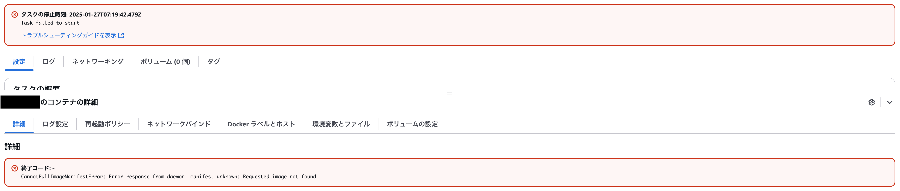
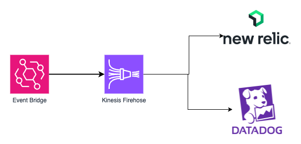
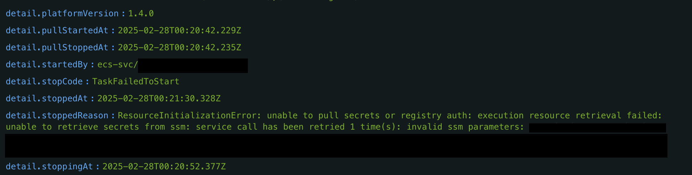

# ECSタスクの停止理由をログに残しましょう

## はじめに

こんにちは。ITインフラ本部 SRE部のシュウです。
本記事では、ECSタスクの停止ログを記録する方法についてご紹介します。

## なぜECSタスクの停止理由をログとして保存するべきなのか？
ECSタスクが起動できなかった際や、異常終了した際は、AWSマネジメントコンソールから停止したタスクの詳細ページを開くと、下記の画像のように停止理由が表示されます。
この例では `CannotPullImageManifestError` と表示されており、イメージの取得に失敗したことが原因であることがわかります。

このように「イメージを取得できない」、「必要な権限が不足している」、「参照しているパラメータが存在しない」などの理由でECSタスクが終了した場合、
AWSマネジメントコンソールから理由を確認することができるが、アプリケーションはまだ起動していないため、アプリケーションのログには何も記録されません。
しかし、この終了理由はデフォルトでは保存されず、少し時間が経過すると消えてしまいます。

この停止理由をログとして保存して、アラートを設定することで、万が一タスクが想定外の理由で停止した際もその理由を把握することが可能になります。



## New Relic や Datadog にECSタスクの停止ログを送信する方法
ECSタスクのステータス変更はAmazon EventBridgeによって検知できるため、下記の構成図のように、Amazon EventBridgeからAmazon Data Firehoseを利用して、New RelicやDatadogに停止ログを送信することが可能です。



## Terraformを使った実装例
### 1. Amazon Data Firehose 用のIAMロールの作成
```terraform
resource "aws_iam_role" "firehose" {
  name = "ecs-task-stop-log-firehose-role"
  path = "/service-role/"
  assume_role_policy = jsonencode({
    Version = "2012-10-17",
    Statement = [
      {
        Effect = "Allow",
        Principal = {
          Service = "firehose.amazonaws.com"
        },
        Action = "sts:AssumeRole"
      }
    ]
  })
}

data "aws_iam_policy_document" "firehose" {
  statement {
    actions = [
      "s3:*",
    ]
    resources = [
      "arn:aws:s3:::<ログ保存用のS3バケット>",
      "arn:aws:s3:::<ログ保存用のS3バケット>/*",
    ]
  }
}

resource "aws_iam_role_policy" "firehose" {
  policy = data.aws_iam_policy_document.firehose.json
  role   = aws_iam_role.firehose.name
}
```
### 2. Event Bridge 用のIAMロールの作成
```terraform
resource "aws_iam_role" "event_bridge" {
  name = "event-bridge-to-firehose-role"
  assume_role_policy = jsonencode({
    Version = "2012-10-17",
    Statement = [
      {
        Effect = "Allow",
        Principal = {
          Service = "events.amazonaws.com"
        },
        Action = "sts:AssumeRole"
      }
    ]
  })
}

data "aws_iam_policy_document" "event_bridge" {
  statement {
    actions   = ["firehose:PutRecord", "firehose:PutRecordBatch"]
    resources = [aws_kinesis_firehose_delivery_stream.ecs_task_stop_log.arn]
  }
}

resource "aws_iam_role_policy" "event_bridge" {
  role   = aws_iam_role.event_bridge.name
  policy = data.aws_iam_policy_document.event_bridge.json
}
```
### 3. Amazon Data Firehose の作成
- New Relic
  - ログ転送用エンドポイント: `https://aws-api.newrelic.com/firehose/v1`
- Datadog
  - ログ転送用エンドポイント: `https://aws-kinesis-http-intake.logs.datadoghq.com/v1/input`
```terraform
resource "aws_kinesis_firehose_delivery_stream" "ecs_task_stop_log" {
  name = "ecs-task-stop-log"

  destination = "http_endpoint"

  http_endpoint_configuration {
    url                = "<New Relic or Datadog のログ転送用エンドポイント>"
    name               = "<New Relic or Datadog>"
    access_key         = "<New Relic or Datadog のAPIキー>"
    buffering_size     = 1
    buffering_interval = 60
    role_arn           = aws_iam_role.firehose.arn
    s3_backup_mode     = "AllData"

    s3_configuration {
      role_arn           = aws_iam_role.firehose.arn
      bucket_arn         = "arn:aws:s3:::<ログ保存用のS3バケット>"
      prefix             = "ecs-task-stop-log/"
      buffering_size     = 1
      buffering_interval = 60
      compression_format = "GZIP"
    }

    request_configuration {
      content_encoding = "GZIP"
    }
  }
}
```
### 4. Amazon EventBridge の作成
```terraform
resource "aws_cloudwatch_event_rule" "ecs_task_stop_rule" {
  name        = "ecs-task-stop-rule"
  description = "Capture ECS task stop events"
  event_pattern = jsonencode({
    source      = ["aws.ecs"]
    detail-type = ["ECS Task State Change"]
    detail = {
      lastStatus = ["STOPPED"]
    }
  })
}

resource "aws_cloudwatch_event_target" "ecs_task_stop_log" {
  rule     = aws_cloudwatch_event_rule.ecs_task_stop_rule.name
  arn      = aws_kinesis_firehose_delivery_stream.ecs_task_stop_log.arn
  role_arn = aws_iam_role.event_bridge.arn
}
```
### 5. New Relic や Datadog にログが送信されたことを確認する
正しく設定が完了していれば、New Relic や Datadog にECSタスクの停止ログが送信されるようになります。
下記の画像は New Relic に送信されたログの一部です。
ECSタスクがパラメータストアからパラメータを正しく取得できなかったため、タスクが停止したことがわかります。


## まとめ
ECSタスクの停止理由をログとして保存することで、ECSタスクが想定外の理由で停止した際もその理由を把握することが可能になります。
本記事で紹介した方法を参考に、ECSタスクの停止ログを保存し、アラートを設定しておくことをおすすめします。

